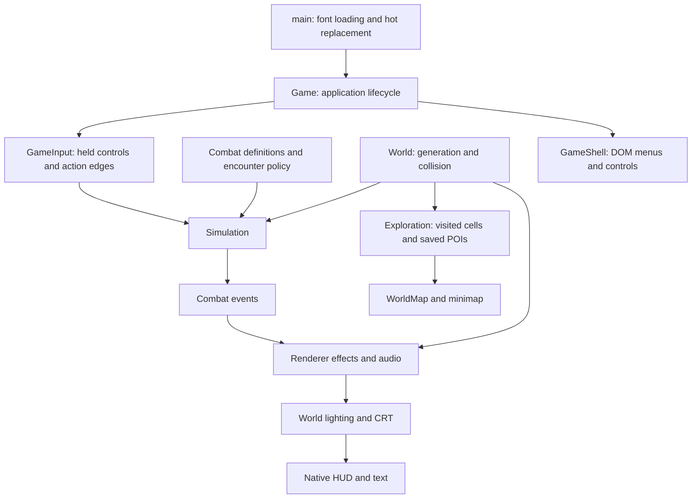

# Implemented architecture

The [living biomes](living-biomes.md) extend the original forest pass with bounded presentation-only wind, material-specific footstep reactions and decorative wildlife across all seven climates. `biome-life-content.ts` owns immutable recipes; `biome-wind.ts`, `biome-life.ts` and `biome-life-art.ts` own shared wind, ephemeral state and drawing. `ground-material.ts` shares water/road/paving weights with World terrain colors. These systems consume interpolated positions through Renderer and have no simulation mutation or reward path. The local `/forest.html` review records the actual world/CRT with staged poses and no gameplay ticks or save access.

The [NPC/vendor readiness review](npc-vendor-readiness.md) records the earlier consolidation assessment. Equipment planning/previews, shared item UI and panel lifecycle now support implemented [NPC services](npcs-and-vendors.md), including atomic saved transactions. That historical town-portal checkpoint passed 519 tests; current verification is in [system status](system-status.md).

Updated 2026-09-06. This describes the local prototype as implemented; `technical-foundations.md` contains the broader design proposals.

The [expansion readiness review](architecture-review-2026-09-05.md) records the current verification baseline, concrete maintenance pressure points and prioritized work before larger iterations.

This game is unreleased and used only for the owner’s testing. Evolve systems directly: update callers and tests together, delete superseded code, and avoid compatibility wrappers, old-API guarantees, or migrations solely to support earlier prototype versions. Saved test progress may be invalidated when required by a change; report that consequence. Preserve history in Git, not parallel runtime implementations. Tests should protect the current intended behavior, not require obsolete features to survive.

## Ownership and dependency direction

The application has four main boundaries: deterministic rules, generated world content, presentation, and browser integration. Combat must remain usable without a browser. Presentation consumes simulation state and discriminated events; it never decides damage, collisions, rewards, or attack timing. The event type requires its own payload, including hit identity/health, chain destinations and ground-warning geometry.

| Owner | State and responsibilities | Lifetime |
| --- | --- | --- |
| `Simulation` | Player, enemies, projectiles, timed ground effects, statuses, pickups, ground equipment, character sheet, RNG, fixed clock, input buffers, combat events | Resets for a new run |
| `combat-content`, `weapon-content`, `equipment`, `encounter-director` | Authored balance, weapon/shield profiles, starter equipment, encounter composition and attack concurrency | Immutable definitions; actor equipment is copied |
| `biomes`, `biome-props`, `wilderness-sites` | Climate definitions/field, prop metadata and mixtures, landmark/camp blueprints | Headless content; bounded deterministic caches |
| `World` | Seed, procedural queries, immutable cached settlement/wilderness blueprints, terrain cache | One world instance; disposed by the application |
| `Exploration` | Visited cells, discovered POIs, schema validation, storage status and delayed writes | Survives new runs for the same world identity; flushes on teardown/page hide |
| `WorldMap` | Visible chart projection, bounded terrain LRU, POI layout and hover, minimap smoothing | Presentation only; disposed with the application |
| `Renderer` | Camera, visible scene cache, art libraries, roof fades, lighting, hit trails, particles, focus | Visual state resets on a new run |
| `PostFX` / `GameAudio` | GPU targets and listeners / audio graph and voices | Explicit disposal |
| `GameInput` | Held keys/buttons, single-use action edges, pointer projection | Cleared on pause, full M map, blur, cancellation, restart; held Tab map entry/exit preserves movement and held mouse buttons; the overlay uses normal gameplay input |
| `GameShell` | DOM surface, accessible controls, menu listeners and toast timer | Explicit disposal; old menu listeners abort on replacement |
| `Game` / `Lifetime` | Phase, event routing, frame scheduling, construction rollback, reverse-order resource teardown | One application instance per hot replacement |

Generated buildings are frozen blueprints. Shop purchase masks and buyback state are stored separately on the character by stable identity, without editing geometry shared by collision, maps, and drawing.

## Where to extend

**Combat content:** `combat-content.ts` owns basic/utility timing, shared cast motion, level-one enemy stats and supported attack behaviors, projectile parameters, and resource-pickup rules. `encounter-director.ts` owns area/biome composition, geographic rank odds and uncapped biome composition. Enemy attack decisions are independent: range, sight and each actor’s windup/recovery determine when it attacks. `roaming-encounters.ts` owns travel/cooldown pacing, small-group templates, camera-relative placement and inactive retirement policy. Simulation owns the planner instance, validates whole groups against collision/sanctuaries/camp footprints, and creates each enemy through the ordinary geographic source snapshot. `combat-geometry.ts` owns sector/swept-contact math. HUD cooldowns, casting effects, player pose timing, enemy names, and melee telegraphs consume the same definitions.

Adding an enemy requires a typed `EnemyKind`, its definition, art dispatch, hover bounds, and intended encounter policy. The exhaustive definition/art records make omissions visible to TypeScript. An enemy can reuse melee, projectile or targeted-ground behavior. `enemy-ai.ts` owns sensing, last-seen memory, patrols, home return, flanking/ranged roles and committed aim. New attack behavior needs contact/cancellation tests; damage and rewards delegate to their dedicated owners while Simulation allocates projectile identities and preserves tick order. This is an explicit combat model, not yet a general skill scripting framework.

`spawn-visibility.ts` shares the current camera rectangle and body/effect margins across automatic births, camp waking/sleeping and retirement. The Game supplies the renderer's current/pending camera envelope before simulation updates; automatic populations wait for that coverage after construction/reset. Sixteen initial ambient enemies populate hidden surroundings, then new four-to-six-member groups require travel and cooldown rather than elapsed time alone. Visible actors cannot be retired by a fixed radial cutoff; only hidden inactive ambient foes can yield capacity as the player moves onward.

`camp-population.ts` retains exact health/casualty records under stable IDs. Garrison admission validates visibility, collision and sanctuary; there is no total actor cap, ambient target, reserved camp budget, or capacity eviction. Distant hidden inactive groups may sleep, preserving source identities. `world-navigation.ts` shares bounded incremental flow fields for obstacle detours. No sleep or retirement grants rewards.

**Experience and rewards:** `progression-content.ts` owns numeric level bounds, monster/item multipliers, rank multipliers, and armor relative to the attacking source. `zone-progression.ts` derives seeded named danger districts from shared road travel/remoteness and immutable spawn-time stats. `progression.ts` owns current-level XP, the shared next-level curve, bounded exact overflow, and level-gap factors. `combat-damage.ts` commits death once and invokes `combat-rewards.ts`, which grants captured XP using the player's pre-award level. `character.ts` grants one skill and five attribute points per gained level and refreshes the level-relative armor estimate without healing. Character slots persist progression through validated checkpoints; only explicit creation starts a fresh character.

`loot-content.ts` owns rank gear counts/tier weights, archetype item-kind weights, and biome weapon/shield profile weights. `loot.ts` rolls a bounded source-level reward from the monster's isolated seed; it never reads player gear, player level, or combat RNG. `items.ts` receives the selected tier explicitly. Flat gear values and percentage budgets have different growth functions. Potions and resource pickups restore a fraction of the maximum resource. See [progression and loot](progression-and-loot.md) for current tables and limits. The development-only `/progression.html` study reads these same rules without running combat or accessing saves.

The renderer owns `ExperienceFeedback` for smoothing and pulses; the HUD reads player XP/level and never awards rewards. Enemy plates show source level/rank; map area inspection queries geographic danger only on revealed terrain. Projectiles retain their source level so armor resolution stays correct after the caster moves or dies.

**Character assets:** `art.ts` is currently a small entrypoint that can be removed or replaced as its callers evolve. `art-types.ts` defines poses and outfit layers; `art-primitives.ts` provides drawing/math helpers; `prop-art.ts` owns finite prop variants. `equipment-art.ts`, `character-motion.ts`, `player-art.ts`, and `enemy-art.ts` separate materials, attachment geometry, animation, and actor drawing. Add armor through the existing piece/mount definitions. `armor-shapes.ts` shares helmet, cuirass and pauldron shapes between the worn character and item icons. `weapon-shapes.ts` shares weapon and shield surfaces. Ground drops reuse that actual gear geometry through item-lifetime caches. The rig, sword trail, sparks, and weapon light must continue to share the same pose and blade position.

**Terrain and settlements:** `biomes.ts` owns seven immutable definitions and a seeded two-dimensional climate field. Jittered region centers sample warped temperature, moisture and elevation; compact radial kernels blend their contributions into normalized biome weights. The 6,400-unit region scale and 512-entry region cache bound local work without changing results after eviction. A Deadwood starting core uses 1,100- and 2,600-unit blend radii in warped coordinates. Ground color, ambient light, map color and prop mixtures consume these same weights, so their transitions agree. See [biomes](biomes.md) for climate identities, content and extension rules.

`biome-props.ts` owns 23 prop families with collision sizes, crown offsets/extents, shadows, sway, emitted lights and per-climate selection weights. `World` chooses species at the actual prop position; ground contacts preserve road and settlement clearance, while projected crowns additionally keep wilderness sites visible. `environment-art.ts` and `biome-prop-art.ts` generate the foliage, stone and groundcover drawings. Their 96-entry sprite LRU supplies 24 seeded variants per family and remains separate from `prop-art.ts`’s base library. Shared metadata keeps visual scale, player occlusion and collision consistent.

Road contours, stone detail, sampled ground colors, layout blueprints, and building drawing have separate owners. `world-query.ts` bounds work before cell enumeration. `SceneVisibility` owns only the current padded viewport and invalidates on world changes and zoom. `GroundLayer` still stitches terrain tiles before subpixel sampling. New biome or layout changes need seed reproducibility, boundary, corridor, and entrance checks. Change generation version only when saved discoveries would no longer describe the generated world.

`wilderness-sites.ts` owns immutable camp, watchtower, graveyard, standing-stone and caravan layouts. `World` queries them once through bounded cell generation for rendering, collision, ambient-prop clearing and discovery. `wilderness-art.ts` draws ground before actors and decor in shared depth order. Camp rosters and tent/soil palettes cover all seven climates; level, rank and reward curves remain owned by progression/loot content. Combat lights receive the finite light budget before environmental lanterns. See [wilderness and encounters](wilderness-and-encounters.md) for the shared contracts and limits.

**Maps and saving:** `world-pois.ts` provides one POI kind registry for generation, saved-data validation, and map labels/colors. `map-view.ts` contains projection, zoom and coordinate bounds. `exploration-save.ts` validates a whole payload before any live merge. Keep character saves separate from chart discovery. `WorldMap.setCampStateReader` reads current run clearing state without adding it to saved exploration; dead garrisons get a distinct cleared marker and tooltip. Exploration keys include the generation identity. Generation 5 starts fresh geography, and the authorized prototype reset removes older-generation characters on the next game bootstrap. Character checkpoints now use separate eight-slot storage and character-scoped exploration keys; see [character saves](character-saves.md).

The chart selects nominal 768-, 1,536- or 3,072-unit terrain tiles by scale, then coarsens further when necessary to stay within 256 visible tiles. Its LRU holds at most 384 entries across detail levels; the small minimap retains the 768-unit detail level. Coarse terrain is drawn only when all covered 48-unit exploration cells are known, and discovery changes invalidate every covering cached tile. Stable POI priority/layout is shared with hit testing; biome labels require revealed homogeneous land and avoid POIs. See [the explored atlas](explored-atlas.md) for the review scenes and chart behavior.

**Menus and input:** `main.ts` only boots the application. `Game` coordinates systems; `GameShell` accepts presentation values and callbacks, without reading simulation state. `GameInput` preserves short taps between frames and consumes them once. `isGameUIPoint` is shared by weapon suppression, hover focus and the cursor. Future panels must join that shared input boundary and clear simulation buffers when changing control context. Native HUD/text rendering stays above world post-processing.

`gamepad-input.ts` owns headless standard-controller selection, radial stick deadzones, button edges, gameplay input projection and neutral-before-rearm safety. Game polls once per frame, handles disconnect pause, projects a player-relative aiming point through the displayed camera and shares the existing ranged assist. `gamepad-menu.ts` adapts focused controls to existing panel keyboard/click handlers, with bounded navigation repeat; it never mutates inventory, skills or commerce directly. Panels and travel clear controller input alongside keyboard/mouse. See [controls](controls.md) for the fixed layout and remaining mouse/keyboard operations.

**Interface kit:** `ui-theme.ts` supplies shared DOM and Canvas materials. `ui-kit.css` owns reusable window, button, slot, readout, tooltip, and scrolling treatments; screen styles own layout. `ui-icons.ts` supplies decorative SVGs, while `ui-components.ts` owns escaped markup and abortable dialog focus. `game-menu.ts` builds menus from presentation values. Read [the UI kit contract](ui-kit.md) before extending inventory or other panels. `/ui.html` reviews actual components at desktop/narrow sizes with a frozen renderer and memory-only exploration.

## Guardrails and verification

Run `npm run check` from the repository root. It runs all deterministic/code-level tests, strict TypeScript checks, a second core compilation without DOM or Node globals, and the production build. The core compilation prevents simulation and generation rules from quietly depending on browser APIs. Architectural tests reject runtime import cycles and combat imports outside that core boundary.

The compiler now rejects unused locals/parameters, missing returns, implicit overrides, and switch fallthrough in addition to strict typing. Some forwarding exports remain from earlier refactoring; they are not compatibility guarantees and should be removed when their callers are updated.

`npm run stats` reports current source/module counts, content counts, dependency counts, configured caps, and sizes from the last production build. Runtime counts exclude development review entrypoints/helpers and historical HUD concepts; content/cache counts come from the live registries. It does not run gameplay or modify saved data. The static layout, rig, HUD, bestiary and encounter review pages remain development-only tools. `/hud.html?plates=1` isolates the three rank heraldry treatments; `/encounters.html` stages actual camp/landmark geometry and warning art without simulation ticks. `/biomes.html` renders frozen real-world climate and transition scenes through the actual Renderer/PostFX; `/atlas.html` reviews the real map across three seeds using only authored in-memory discovery. Neither page advances combat or accesses saved charts. Automated browser gameplay tests are excluded from `check`; the user controls playtesting in their chosen browser; static agent previews use the in-app browser.

The refactor was compared against the previous implementation: 86,400 deterministic combat ticks across 12 scenarios matched actor/projectile/pickup state and events; 2,484 pose, equipment, rig and prop samples matched procedural drawing commands. These were one-time checks of that refactor, not requirements to preserve old behavior in future iterations, GPU performance measurements, or visual acceptance.

## Expansion limits

The current architecture is suitable for incremental additions at the prototype's population and cache budgets. It is not a claim of production readiness or arbitrary scale. Enemy separation and several contact queries still scan actor lists; large crowds will need measured profiling and spatial indexing. Terrain/art generation is synchronous on the main thread; worker generation should follow evidence of frame stalls. Origin rebasing or another precision strategy will be needed for truly unbounded coordinates.

Exploration and characters use a dedicated IndexedDB worker with atomic transactions and revision checks. The character and chart are separate local records; cross-record cloud synchronization will require one committed manifest. Eight slots retain last-good backups; each character owns its own chart. [World history](world-state-longevity.md) now compacts exhausted sources while preserving exact receipts and pending rewards. Save export/import, respecs and arbitrary skill scripting remain separate work. Preserving old prototype formats is not a current requirement.

## Character rules and panels

`character-types.ts` is the shared sheet/item contract. `items.ts` generates seeded equipment; `inventory.ts` validates transactional moves/equips and attribute spends; `skill-tree.ts` owns graph connectivity and node allocation. `character-stats.ts` merges item, allocated-attribute, and tree bonuses exactly once. `character.ts` projects these into runtime combat stats and worn weapon data, clamps resources without healing, grants progression points, and validates skill assignments. `executeCharacterCommand` in `character-commands.ts` owns validation, mutation and projection refresh together. Game submits typed commands and then refreshes visible panels; it never sequences raw sheet mutation and combat refresh. Failed commands leave resources and projections unchanged.

`skill-tree.ts` generates 2,333 immutable nodes in 150 passive constellations plus 23 skill-development groups, with 3,166 curved connections and world bounds. Three petals with five staggered terraces establish regional direction; short connectors, central notables and inner hybrid bridges provide alternate paths. Thirty-six early choice nodes provide diversified bonuses at two to four points. Nine weapon schools contain seventeen major skills, with first and advanced skills three and four points from the origin. Three additional ultimates occupy deep Arcana paths. `skill-progression.ts` resolves purchased/active ranks, sixty selectable variants and skill-specific leaf passives, mastery limits and Overload; commands validate their mutations and save v4 counts their point costs. The graph owns deterministic placement and stat recipes, not presentation. `skill-tree-routes.ts` computes the shortest additional-point route from the allocated build without mutating it. `skill-tree-art.ts` renders the culled curves, cluster labels, states, and route preview at native resolution; `skill-tree-glyphs.ts` shares code-defined stat/skill engravings between Canvas nodes and DOM details. Keep view transforms, zoom-dependent detail, and hover state out of allocation rules.

`skill-content.ts` owns twenty active skill definitions, weapon requirements, compatible-hand selection, and shared icons. `skill-execution-content.ts` supplies deeply frozen profiles for sweeps, dashes, radial/cone attacks, guards, backstabs, projectiles, ground attacks and chains. Ranges, arcs, speeds, durations, status potency and numeric UI labels share those profiles. `skill-combat.ts` dispatches exhaustively by execution kind through a narrow context; adding a content variant no longer needs a new skill-name branch. Skill cooldowns are keyed by skill identity, so moving slots cannot reset them. `Simulation` preserves the fixed order and advances player cooldowns/lunges/guard. `combat-status.ts` applies and ticks burns, slows and stuns; `ground-effects.ts` snapshots and advances delayed attacks. `combat-damage.ts` commits contacts/deaths and calls `combat-rewards.ts` for source-level XP, drops and flask recharge. Loot collection remains in Simulation. Ground loot art and HUD skill art remain presentation-only.

`weapon-content.ts` owns thirteen generated weapon profiles and three shield profiles. `inventory.ts` plans both hands before committing a swap, including bag space for displaced gear. `equipment.ts` derives each selected weapon's attack independently; two-weapon basic attacks alternate their own timing and damage. Each `Attack` stores its weapon/hand snapshot. Staff bolts use spell scaling and other basic attacks use physical attack scaling, once each.

`projectile-combat.ts` owns swept projectile contact, hit-once identities, piercing, ricochets, explosions, status payloads, and actual-damage life steal. Payloads are copied at release and remain independent of later equipment changes. The runtime bounds projectiles and ground effects through shared limits. Damage/death and rewards have separate headless owners; neither presentation nor status application can award loot independently. Visual code consumes confirmed events: `projectile-art.ts` draws projectiles, `skill-effects.ts` renders bounded blasts/chains/ground markers/blocks, and `status-art.ts` draws burns and frost. `weapon-shapes.ts` shares silhouettes between `equipment-art.ts` and item icons; the character rig owns all grip and draw-hand positions.

`InventoryPanel` and `SkillTreePanel` consume the player and callbacks; `Game` owns pausing, input clearing, mutation commits, and focus return. Slot DOM remains stable where practical and dynamic atlas control updates retain focus. `item-art.ts` projects equipment into the same material layers used by the world character, paper doll, and procedural icons. The static `/character.html` entry stages review data without simulation ticks or save access. See [character systems](character-systems.md) for formulas and current limits.

## Adding combat behavior after the expansion refactor

- For a new skill variant, add its typed ID, metadata/icon, execution recipe and tree major. Reuse a recipe kind whenever its semantics fit. A new behavior kind must implement an exhaustive handler; missing recipes or handlers fail compilation.
- Change skill radius, projectile speed, duration, chain limits and status strength in `skill-execution-content.ts`. Numeric descriptions/readouts and ground warnings consume the same values. Timed effects snapshot damage, radius, style and burn payload at release.
- Apply slow, burn and stun through `combat-status.ts`. Reapplication retains the strongest strength and longest remaining duration independently, never sums stacks, and does not reset accrued burn time. Death suppresses further effects/AI; partial final burns pay once.
- Route actual health loss through `combat-damage.ts`. Only its committed death path invokes the reward owner. Keep RNG draws and event ordering stable when extracting further behavior.
- Use `executeCharacterCommand` for runtime character actions. Low-level inventory/tree operations remain the transactional sheet implementation and fixture tools, not a second UI mutation route.
- Extend `CombatEvent` as a discriminated payload and update consumers through narrowing. `tests/type-contracts.ts` has compile-only negative checks for missing or mismatched payloads and incomplete recipes/commands.

The first extraction reduced Simulation from 712 to 616 lines while preserving its ordered clock. A one-time comparison against checkpoint `fad5f4a` matched public actor/projectile/item/pickup state, resources, rewards and events for 64,800 ticks across basic combat and all seventeen skills. This validates that refactor at its tested scenarios, not arbitrary gameplay equivalence or GPU performance. Existing rules may change deliberately in later iterations; no compatibility layer was introduced.

## Layered procedural world art

The graphics overhaul keeps geometry in authored TypeScript recipes. `tree-art.ts` returns a rooted trunk sprite and two optional foliage surfaces; `Renderer` moves/fades foliage independently and culls fully offscreen sprites before cache lookup. `SceneVisibility` keeps 300 units of prop coverage, including the tallest crown and its 65-unit refresh allowance.

`ground-art.ts` has two responsibilities: stable world-coordinate deposits generated with terrain tiles, and a bounded prop-ground stamp library. `material-art.ts` draws clipped stone texture. `architecture-art.ts` builds cached roof/apron details and height-aware wall weathering. `atmosphere-art.ts` consumes prop anchors and presentation time, with no simulation, collision or save mutations. All art caches remain finite; budgets are recorded in system-status.

`game/scripts/render-art-review.mjs` is an optional static CPU exporter. It uses an explicitly supplied, already-installed Canvas package and the actual World/Renderer, with no browser or gameplay ticks. Its exports are explicitly before the WebGL CRT pass; browser reviews remain the reference for the final display treatment. It adds no runtime package dependency.

## Character hall and persistence

`TitleScreen` presents eight slot records and invokes application callbacks. `CharacterSession` owns the active slot, compatibility and writer token; `CharacterRepository` atomically stores validated records and retains the prior valid checkpoint. `character-save.ts` validates the entire sheet and world progress before `Simulation.restoreCheckpoint` rebuilds projections. Character actions and application lifecycle boundaries trigger saves; the frame coordinator also writes every ten seconds. `character-summary.ts` derives display-only power, while `character-portrait.ts` shares the real equipped rig between the hall and inventory. See [save boundaries](character-saves.md).

## Pre-NPC consolidation

Equipment planning now lives in `inventory.ts:planEquipmentChange`; equipment commits, drag eligibility and full-build previews share it. `equipment-preview.ts` uses the ordinary stat and weapon derivations on the planned sheet without mutating live resources. `item-ui.ts` / `.css` and `item-tooltip.ts` are reusable presenters for inventory and vendor data. They separate item values from effective On equip changes, including any displaced shield/second weapon.

`panel-coordinator.ts` centralizes phase transitions and panel registration. Old views close before new ones mount, input/buffers clear on transitions, and focus returns only on play resumption. Game retains application/session orchestration and submits transitions; panels retain their own focus-trap lifetime. The consolidation adds no NPC/trading state or save-format changes. Verified with 492 code tests and application/core compilation plus production build.

## Town services and item recipes

- `npcs.ts` derives stable shopkeepers from existing building blueprints and validates reach/line of sight. `npc-art.ts` draws procedural role silhouettes, idle/work gestures and shared emblems. NPC stock never mutates generated geometry.
- `items.ts:deriveItem` rebuilds item values from explicit source profiles, roll qualities and enhancement. `item-improvement.ts` changes those recipes for guaranteed upgrades and rerolls. No reverse inference from rounded stats.
- `commerce.ts` owns deterministic catalogs/epochs, quotes, bounded prices and pure complete plans. It uses the shared wallet API. Plans copy affected containers; failure does not advance item revisions or operation RNG.
- `commerce-command.ts` validates reach, plans, refreshes a proposed player, persists the candidate checkpoint, then commits live state. The active Game session also validates the service phase/NPC. Persistence failures and stale writers retain the original character.
- `item-validation.ts` and `commerce-validation.ts` share bounded recipe/commerce validation with save version 3. Stock issuance IDs encode vendor/epoch/slot; ownership validation prevents a current issued item remaining available in stock. Old save payloads require new characters, without destructive conversion.
- `service-panel.ts` composes shared item cells/tooltips, compact headers, operation previews and separate Equipped/Inventory sections. UI submits typed quotes; it never spends gold or mutates the character. Equipped upgrades refresh both hand projections without restoring life/mana.
- The registered `service` phase shares panel suspension, focus, input clearing and teardown. `/services.html` and `/services-narrow.html` stage memory-only static reviews, never a gameplay session.

## Town portal

`travel.ts` owns bounded travel state, anchor placement, fixed-step channel rules, safe landing and known map markers. `travel-command.ts` validates an outward/return interaction, stages a checkpoint and persists before calling `Simulation.relocate`. Relocation must never call `reset`/`restoreCheckpoint`: preserve actors, loot, source rewards, camp memory and resources. Clear current attacks/inputs and establish destination spawn coverage before the next tick. `RoamingEncounters.relocate` discards discontinuity travel credit without resetting the warmup population. The simulation cancels casting at the damage boundary, so healing within a frame cannot conceal interruption.

`travel-art.ts` draws code-generated rings/threads/motes; the renderer owns cancellation fading and camera snapping. `GameShell` presents the small portal control and native progress above post-processing. The world map reads current portal markers without storing them in explored terrain. `/portal.html?state=cast` and `?state=town` are frozen, save-free reviews. Full waypoint travel remains unimplemented.

## Interactive world events (2026-09-07)

`event-recipes.ts` describes assault, defense, seal and timed recipes; `wave-system.ts` advances admission-aware timers and completed-wave scores. Cursed chests bank scores on expiry/death/departure, and automatic payouts run through the durable command barrier. `chest-art.ts` and `treasure-flight.ts` share lid motion, opening bursts, saved staggered flights and checked landing points across world/dungeon rewards.

`poi-sites.ts` places immutable interaction anchors and roadside containers; `poi-content.ts` defines states, choices, blessing metadata and target selection. `poi-runtime.ts` owns interruptible channels and bounded offscreen placement without an actor-count budget. Simulation snapshots surviving guardians and casualties before culling, suspension or saves.

`poi-command.ts` stages a whole checkpoint and persists it before committing choices, XP, buffs and physical loot. `poi-rewards.ts` reconstructs deterministic component recipes; delivery masks prevent rerolls or duplicate issuance when capacity is full. `poi-validation.ts` validates the bounded ledger and trial. `poi-panel.ts` registers the event phase with the shared coordinator; `poi-art.ts` renders presentation only. Blessings pass through normal character derivation. Beacon discovery replays from saved facts rather than rewarding through map rendering. `/events.html` is a frozen save-free review.

## Regional world generation

`world-geography.ts` owns rotated/jittered 2D settlement sites and inward parent selection. `road-shape.ts` owns shared curved routes, bounded local segment caches and travel estimates. `zone-progression.ts` assigns named, warped districts fixed levels from those routes and remote hazards. `map-zone-art.ts` presents discovered boundaries and decluttered labels on the full map. These owners remain headless except map presentation. See [world generation](world-generation.md).

**Goblin warbands:** `goblin-camps.ts` transforms one third of nonstarter camp blueprints into a ranked chief plus 10–15 small followers. `warband.ts` updates short-lived local orders before individual AI decisions; rush damage snapshots at windup. Orders require shared camp identity, range and line of sight, and cannot cancel home return or sanctuary protection. Chief death briefly routes survivors. `goblin-art.ts` supplies both procedural silhouettes and the horn warning; camp population, casualty persistence and POI completion stay with their existing owners. `/encounters.html?view=warband` is a frozen full-pack review.

## Dungeon locations (2026-09-06)

`DungeonWorld` is a distinct active world adapter; the original `World` remains the surface chart/geography owner. `dungeon.ts` supplies immutable connected room/corridor geometry and bounded navigation. `dungeon-state.ts` separates persistent rosters/contents from live actors; `dungeon-runtime.ts` streams at most 24 actors through the existing visibility exclusion. `dungeon-boss.ts` uses shared AI mutation callbacks and damage/status owners.

`dungeon-command.ts` stages whole location changes and reward delivery before persistence. Never use floor coordinates for geographic level lookup or overwrite the surface exploration chart. `Game.setLocationWorld` selects the adapter before restoring the checkpoint and establishes camera coverage before simulation resumes. Shared `EventChannel` also opens crypt chests. `DungeonMap` owns only floor presentation. See [Dungeons](dungeons.md) for rules and bounds.

## Runtime orchestration after consolidation

`journey-controller.ts` owns incremental search cadence, arrival checks, J/mini-log coordination and surface/dungeon/return-portal marker routing. It reads live host accessors so character/world switches cannot retain stale simulation or chart references. It delegates durable tracking commands to `journey-command.ts` and actual rewards to simulation/source commands; it does not duplicate those rules.

`location-controller.ts` routes surface and dungeon portal actions, stages/persists a transition, then requests world replacement and one arrival callback. Game's shared arrival boundary clears keyboard/gamepad/touch input, resets and snaps the renderer, establishes spawn coverage, updates area/map presentation and focuses the canvas. Failed writes never replace the world. The application durable-action barrier continues to serialize saves and block conflicting actions.

The controllers are narrow current owners, not service locators or compatibility adapters. Rendering, command validation, damage/rewards, item derivation and database logic retain their existing boundaries.

### Equipment affix behavior

`equipment-affix-content.ts` owns specialist metadata, discrete skill-rank quantiles, skill-family weighting and combat caps. `items.ts` combines these with slot pools; `item-improvement.ts` and validation consume the same roll recipes. `affix-combat.ts` owns short-lived Spellweave/Afterguard timers and consumption; damage/reward owners trigger them, simulation advances them, and attacks snapshot their potency. Neither module imports rendering or storage. `resolveSkill` separates purchased/casting ranks from gear potency and applies area/pierce bonuses to immutable execution recipes used by both combat and UI.

Each skill has three exclusive three-point leaves: potency, efficiency, specialization. `skill-progression.ts` owns leaf IDs, per-skill bonuses and resolved recipe changes; the graph's fixed fan orientations require no runtime placement search. `skill-node-presentation.ts` shares owner/role labels across hover, inspector, search and branch emphasis. `skill-tree-tooltip.ts` builds structured glass hover cards while Canvas keeps the geometry. Removed school-specialization connector allocations are not migrated.

## Regional enemy actions

`combat-content.ts` owns basic/signature enemy profiles and `enemyAttackDefinition`; normal AI and warning drawing consume the same snapshotted choice. Regional enemies cycle two basic windups and one signature, with source-damage ratios captured at commitment. `regional-enemy-art.ts` shares depth-sorted anatomy between living figures and articulated collapses. See [regional monsters](regional-monsters.md).
