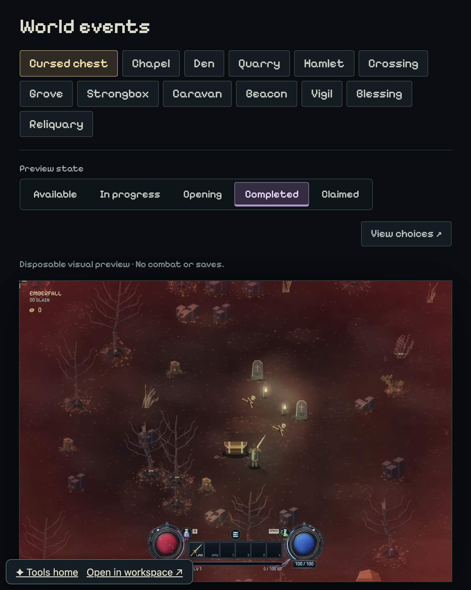
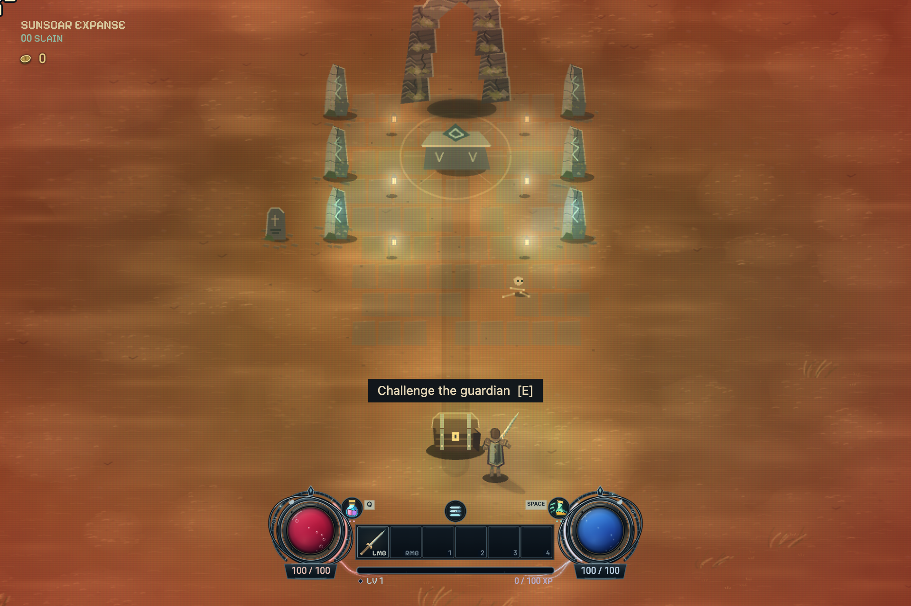
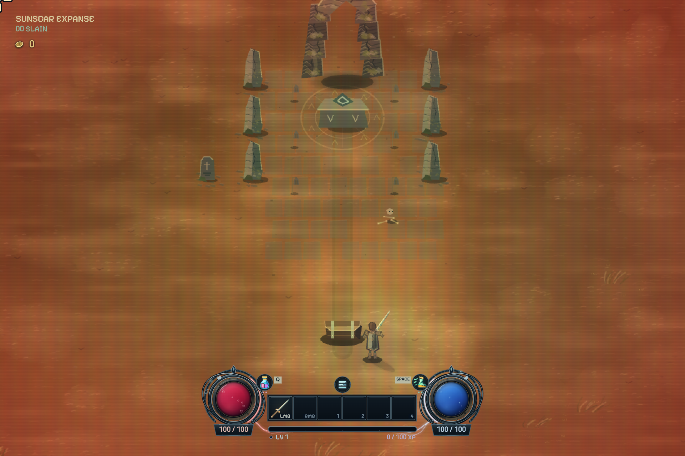
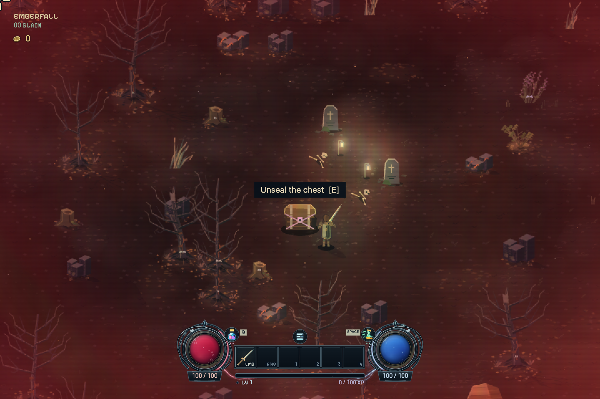
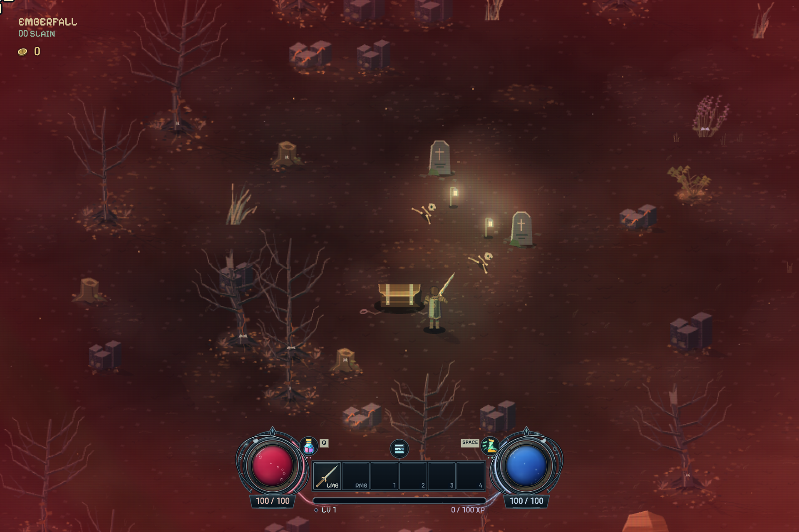
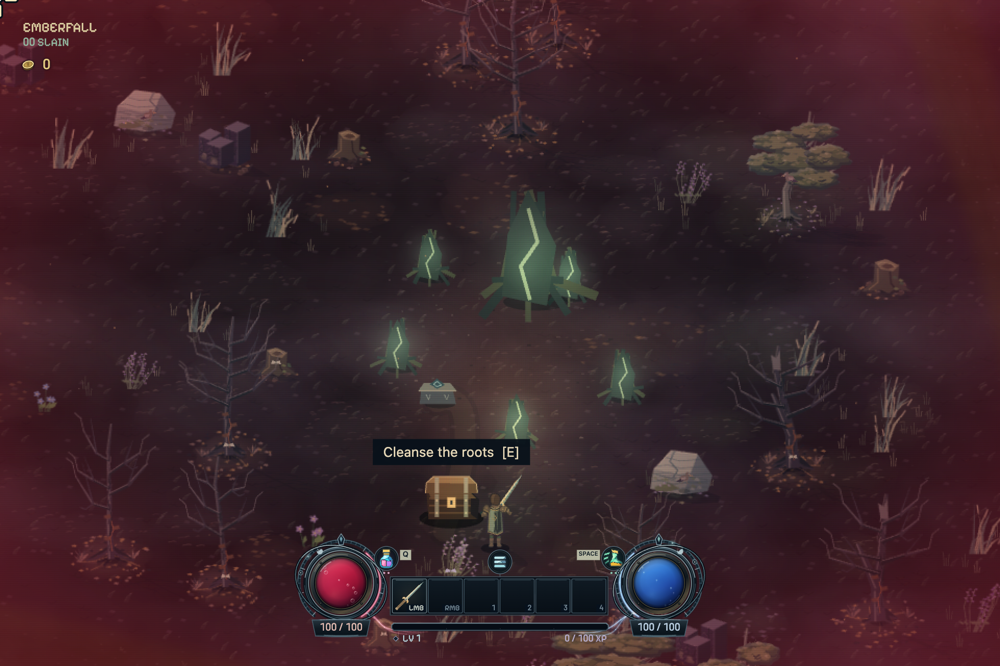
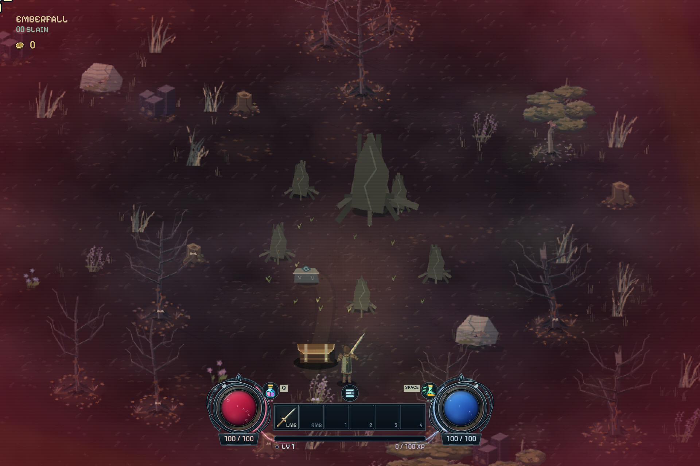

# Event aftermath comparisons

Captured from the local, save-free event review. The overview preserves the
review controls to show the new Completed state. Each comparison below uses a
native 1920 x 1280 game-canvas capture with the same event seed and fixed camera.

## Completed review state

## Ruined Chapel

| Available | Completed |
| --- | --- |
|  |  |

## Cursed Chest

| Available | Completed |
| --- | --- |
|  |  |

## Corrupted Grove

| Available | Completed |
| --- | --- |
|  |  |
