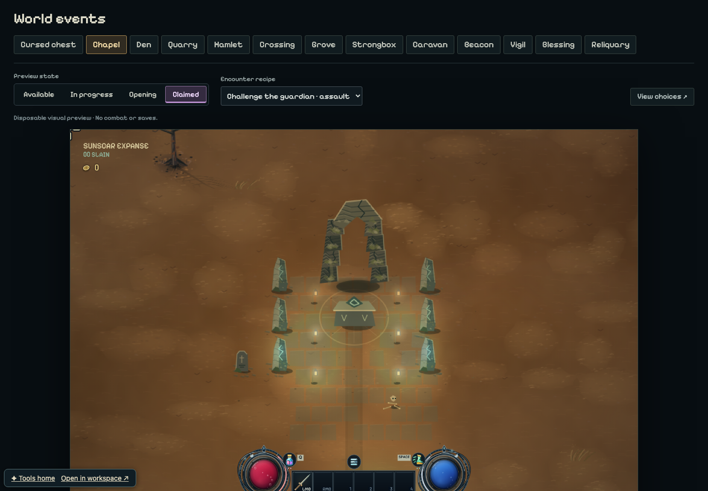
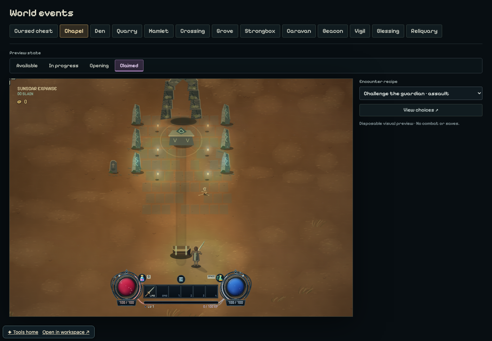
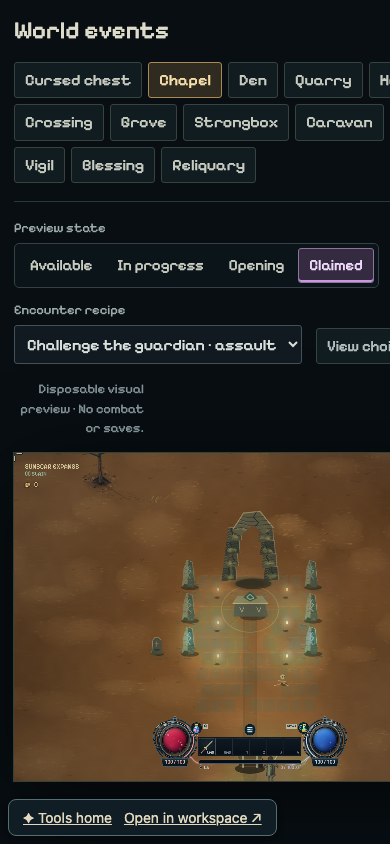
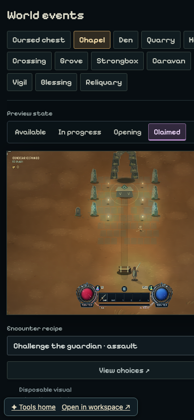

# Event review stable layout

Local captures of the Ruined Chapel in the `Claimed` state, comparing the
public upstream baseline with the stable event-review workspace.

## Desktop · 1440 × 1000

| Before | After |
| --- | --- |
|  |  |

## Mobile · 390 × 844

| Before | After |
| --- | --- |
|  |  |

The captures use the same event, preview state, encounter recipe, and viewport
within each comparison. They are visual-review evidence only and do not access
playable saves.
