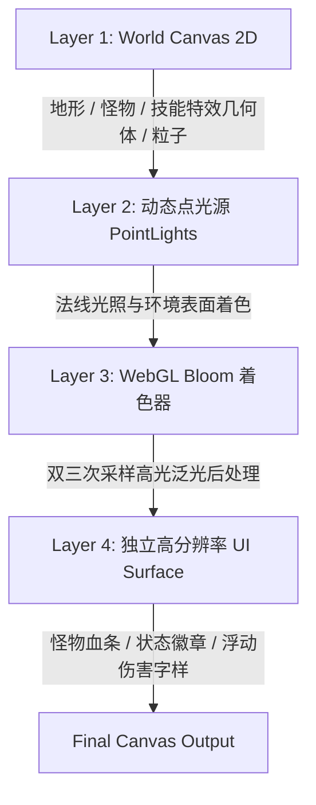

# 🎨 原生渲染与特效管线规范 (Rendering & Spell Art Pipeline)

Evergrow 采用自研的四层分层渲染架构，确保所有技能特效与光照能够在低分辨率暗黑像素奇幻风格下保持统一的视觉质感。

---

## 1. 4 层渲染流水线 (4-Layer Pipeline)

### 1.1 Layer 1: 世界画布 (World Canvas)
- **分辨率**：原生像素视口（720 × 500）。
- **绘制内容**：
  - 地形网格与地表动态湿痕；
  - 角色与怪物人形骨骼与受击状态；
  - **技能几何图元**：
    - `drawSingularityImpact`：深空黑洞核心（`#080410`）、对数螺旋吸入流光（`#c084fc`、`#67e8f9`）、向心收缩火星。
    - `drawCombustionImpact`：白热核心、12 瓣高斯多边形太阳耀斑冲击花瓣（`#ff4d79`、`#ffa040`）、环形膨胀波。
    - `drawLightning`：锯齿折线闪电电弧。

### 1.2 Layer 2: 动态点光源光照 (Dynamic PointLight Illumination)
- 技能不仅在世界层产生几何粒子，还会向光照系统注册瞬时 `PointLight`：
  - **Singularity**：注册 `#a855f7`（深空幽紫）点光源，半径达 $180 \times 2.3 = 414\text{px}$，照亮周围营地帐篷、木箱、地面石块。
  - **Combustion**：注册 `#ff0055`（炽热洋红）点光源，半径达 $120 \times 2.0 = 240\text{px}$。
  - **Cascade**：沿折线电弧中点注册 `#67e8f9` 瞬态闪烁电光。

### 1.3 Layer 3: WebGL Bloom 后处理 (PostFX Phosphor Bloom)
- 对世界画布中的高亮度区域（如黑洞电弧流线、白热太阳核心）进行 GPU 提取与高斯泛光混合，呈现暗黑复古 CRT / 柔和荧光质感，杜绝生硬的 2D 贴图边界。

### 1.4 Layer 4: 原生高清 UI 面板 (Native UI Surface)
- 在 Bloom 处理之后叠加上屏，保证**字体、血条、状态徽章与浮动伤害数字**边缘清晰、可读性极高：
  - 反应标签字样：`SINGULARITY` (淡紫 `#c578ff`)、`COMBUSTION` (洋红 `#ff4d79`)、`CASCADE` (青蓝 `#67e8f9`)。
  - 伤害数字：浮动跳字采用大号等宽像素字体，受击产生轻微弹性放大动效。
