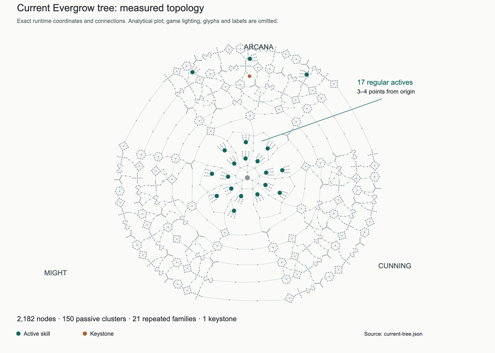
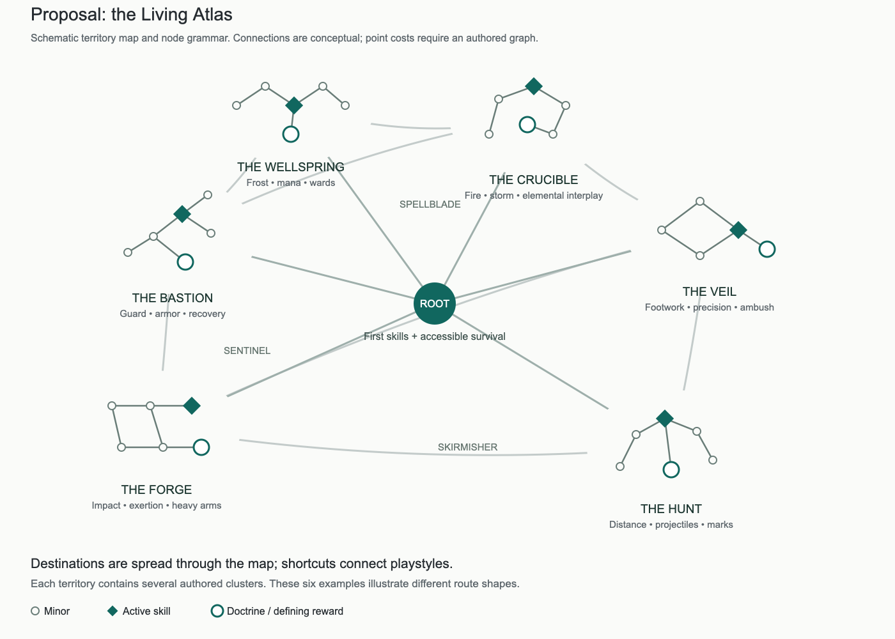

# Evergrow skill tree audit and redesign

**Recommendation:** replace the generated three-petal atlas with a smaller, authored **Living Atlas**: six asymmetric territories, meaningful hybrid routes, active skills distributed through progression, and passive destinations that change how a character fights. Keep active-skill unlocking in the tree and the five assignable skill slots. Build movement and defensive choices into the first useful routes; give physical and ranged characters their own later ambitions.

The central problem is the distribution of decisions. Evergrow has enough nodes to suggest enormous depth, but most purchases repeat the same arithmetic. Its strongest design material—the active skills, specialization recipes, mixed-hand combat and conditional equipment effects—occupies a small fraction of the map.

This is a design proposal, not implemented balance. Measurements refer to local source `53f25e0486cb97ce01b14e780f87b95ff1d39a92`, inspected on September 12, 2026. PoE comparisons use GGG's official exports identified as **PoE 1 3.29.1** and **PoE 2 0.5.5**, alongside official design explanations. Proposed values are initial tuning hypotheses. No gameplay, save changes, publication or deployment accompanies this report.

## 1. What the current tree actually contains

The audit imports the runtime graph and shared skill resolver. All distances below are shortest connected purchases from the free origin, at one point per node. They exclude optional ranks and detours. Because characters start with zero points and earn one per level, a three-point route is first affordable at level four. A shortest route to each destination is not the cost of acquiring all destinations together.[^9][^10]

| Measured property | Current result | Design implication |
| --- | ---: | --- |
| Nodes / connections | 2,182 / 2,923 | A large, connected map exists already. |
| Passive constellations | 150 | Too many locations for the authored content available. |
| Distinct passive family recipes | 21 | Every family repeats seven or eight times. |
| Ordinary constellation nodes | 1,695; 77.7% of the tree | Most of the visual map is repeated passive content. |
| Ordinary constellation minors | 1,545 | Each cluster repeats its family's same minor bonus. |
| Nodes with generic stat bonuses | 1,963; 90.0% | Most nodes use the same additive stat machinery. |
| Distinct generic bonus packages | 45 | This counts exact stat/value combinations, not unique mechanics. |
| Generic stat keys represented | 19 | Much of the game's existing stat vocabulary is absent. |
| Active skills | 20 | Nine basic, eight advanced, three ultimate. |
| Skill variants / precursor nodes | 60 / 120 | Every skill repeats three potency → efficiency → variant leaves. |
| Rank-ceiling masteries | 17 | These permit paid ranks 6–7; they are not PoE-style selectable masteries. |
| Keystones | 1 | Arcane Overload is the only explicit tree-wide tradeoff destination. |
| Longest shortest route | 34 points | Physical size greatly exceeds the progression depth implied by routing. |

These categories overlap: for example, ordinary constellation nodes are also stat-bearing nodes. They must not be added together. The graph has 742 independent cycles, so a lack of connections is not the main problem. Many connections lead to interchangeable rewards.[^9]



### 1.1 The unlock pacing has an empty middle

| Origin distance | Nodes in band | Newly reachable active skills |
| --- | ---: | --- |
| 0–4 points | 75 | All 17 regular skills |
| 5–9 points | 268 | None |
| 10–19 points | 724 | None; rank masteries and Overload appear |
| 20–29 points | 960 | Absolute Zero at 22, Cataclysm at 23, Tempest at 25 |
| 30–34 points | 155 | None |

A character can specialize in an advanced action at level five, but a character following deeper routes sees no new active destination at costs 5–21. Specializations do add early behavioral changes, so these levels are not devoid of choices. The problem is that **new verbs are almost entirely front-loaded**, while later exploration mostly offers more of the same stats.[^9]

The union of the runtime's deterministic shortest paths can buy all 17 regular unlocks for 37 points. This is a feasible connected route union, not a proven minimum. Equipment restrictions and five slots prevent using everything together, but unlock geography still provides little distinction between early and advanced abilities.

Current route semantics also undermine the intended fiction. One shortest path to Cataclysm passes through **Meteor Mastery without unlocking Meteor**. A shortest Tempest route passes through **Soul Siphon Mastery without unlocking Soul Siphon**. Absolute Zero's shortest route crosses Arcane Overload, although its toggle starts disabled. These are valid under current rules. They make development rewards function as travel tolls even when they provide no relevant immediate benefit.

**Redesign rule:** ordinary roads must bypass optional tradeoffs, skill-specific development and specialization selectors. Access to another region must not require buying a mastery for an unlearned action.

### 1.2 Repetition extends beyond shapes

The five outer silhouettes—diamond, hexagon, rays, wings and compass—change appearance. They do not change the underlying purchasing question enough. Each constellation has one numerical notable and otherwise identical minors, drawn from the same 21 families. Epithets change names without changing behavior.[^9]

Examples make the gap clear:

- **Bloodletting** gives attack damage and, on the notable, life on hit. It does not create bleeding or a wound mechanic.
- **Spirit Ward** gives life and mana. It does not create a ward.
- **Ghost Step** gives movement speed and Dexterity. It does not change dodging, disengagement or passage through enemies.
- **Battle Rhythm** gives speed and reduced mana cost. It has no rhythm condition.
- The **Sentinel** school unlocks shield skills, but the passive tree contains no block-chance or block-reduction bonuses.

These can be acceptable names in isolation. Repeating evocative names over ordinary arithmetic across the entire tree weakens trust that an unfamiliar destination will do something unfamiliar.

The early schools also repeat. Each domain supplies three early bonus recipes, reused for entrances and the three-node backbones. “Thirty-six early choices” describes nodes, not 36 different decisions. Several advertised backbone choices are sequential purchases, rather than alternatives.

### 1.3 The tree lags behind the game around it

`deriveCharacterStats` and existing combat systems already support the following effects, but none appear in the tree's generic bonus objects:[^11]

| Existing runtime capability | Opportunity in the tree | Condition to preserve |
| --- | --- | --- |
| Fire/Frost/Lightning/Arcane and all-element resistance | Accessible survival branches and elemental identities | Existing 75% resistance cap; no new mandatory cap increases |
| Block chance and block reduction | A real shield specialization | Only active with compatible shield equipment |
| Area of effect | Melee sweep, nova and ground-control choices | +20% area means about +9.5% radius under the current square-root conversion |
| Projectile pierce | Precision routes that change target coverage | Explosive projectiles still detonate; applicable projectile types must be stated |
| Mana on kill | Pack-oriented sustain | Not a solution to a boss with no adds |
| Potion restoration | Recovery-oriented builds | The same shared life/mana potion and charge system |
| Spellweave | A deliberate melee/magic hybrid corridor | Opposite-action priming and once-per-action consumption |
| Afterguard | Shield defense with a combat condition | Armor after a block protects subsequent physical hits |
| Named skill bonuses | Optional skill-specific investment | Gear-like ranks must not grant an unlearned skill |

Adding these is relatively low implementation cost compared with inventing minions, totems or a new damage channel. It still requires rebudgeting gear and tree contributions together. Duplicating a strong equipment modifier across ten tree nodes would create another numerical pile-up.

Some fields are deliberately **not** appropriate to copy blindly. Elemental weapon affixes are weapon-local recipes; putting flat elemental damage into generic tree bonuses requires tracing their ownership and consumers first. Gold and XP gains already exist, but adding them to combat routes could make economic efficiency a compulsory build tax. Keep those outside the first combat-tree redesign.

### 1.4 Survival and movement coverage are narrow

Nineteen of the twenty active skills deal damage. This does not mean nineteen are purely offensive: Frost skills control, Shield Bash and Earthshatter stun, Rift Lunge moves, and Soul Siphon heals. Nevertheless, **Bulwark is the only dedicated non-damaging defense**, and **Rift Lunge is the only dedicated active displacement action**. Lunge needs a sword, axe or dagger; Bulwark needs a shield.[^10]

A bow user has no active escape or dedicated defensive skill. A staff user has control and Siphon, but no active escape or true ward. A two-handed mace user cannot use Lunge or Bulwark. Daggers have Backstab but no advanced dagger branch. All three ultimates require a staff or wand; Might and Cunning have none.

The universal dodge and potion are valuable baseline survival tools. They should stay universal. New movement and defensive unlocks should broaden tactical choices around those tools, without making basic playability dependent on buying them.

## 2. What makes Path of Exile 1 interesting

### 2.1 It gives the map several different jobs

PoE 1 separates broad passive investment, major rule changes, selectable masteries, item-driven customization and class specialization. Active gems and their supports contribute another independent layer. Its official overview describes a shared tree with different class starts, cross-discipline travel, keystones and jewels.[^1]

The useful lesson is **several scales of commitment**. A small purchase improves a current need. A cluster establishes a specialty. A keystone changes the build's rules. A jewel can make a discovered item relevant to a location. A separate specialization grants identity without requiring every basic stat on the world map to express it.

Evergrow has one broadly functioning layer—additive bonuses—plus local skill modifications. It needs a middle layer of recognizable combat identities and a deeper layer of consequential rules.

### 2.2 Keystones turn restrictions into build problems

In the pinned PoE 1 export, Chaos Inoculation exchanges almost all life for chaos immunity; Resolute Technique removes critical strikes in exchange for unavoidable hits; Point Blank makes projectile damage depend on travel distance; Mind Over Matter directs part of incoming damage to mana.[^2]

The interesting part is the chain of consequences. A resource becomes defensive. A previously valuable stat loses relevance. Positioning affects output. A build starts searching for gear and supporting nodes that solve the new problem. The keystone creates a project.

Evergrow's Arcane Overload is narrower: extra spell damage for extra mana demand. That is a legitimate overcasting choice, but one damage/cost tradeoff cannot support a whole atlas. It does not create a new targeting pattern, defensive layer, equipment relationship or resource loop.

Do not copy PoE's names and coefficients. Evergrow has no comparable accuracy/evasion system or energy-shield layer, so several famous PoE keystones would be empty, misleading or destabilizing here.

### 2.3 Masteries make repeated themes more useful

GGG's Scourge redesign concentrated clusters around their main function and moved niche properties into selectable masteries. After taking a cluster's notable, a player could spend a point on a thematic choice.[^3]

That addresses a problem Evergrow already has: a build may need a specialist effect without wanting to travel across half the map solely because one unique copy exists there. A thematic selection available from several suitable entry points allows accessible specialization while preserving route costs.

Evergrow should adapt this as **Doctrines**. The name avoids confusion with the existing rank-ceiling “Mastery.” A Doctrine would offer a small choice of behaviors or sustain solutions after committing to a relevant cluster. It would not be another list of three increasingly large damage bonuses.

### 2.4 Gear can change the map's meaning

PoE's Cluster Jewels extend the outer tree with item-authored passive content, creating a relationship between loot, crafting and route planning. GGG introduced them as an expansion of the tree rather than simply another equipment slot.[^4]

That is an attractive long-term idea for Evergrow, but its current inventory already contains a substantial charm subsystem. Another dense passive-item layer could double the same complexity. A later **Relic socket** should therefore provide one authored rule modifier, with a strict budget and no recursive sockets. It should not accept ordinary charms and multiply their benefits again.

### 2.5 Compact specializations produce recognizable identities

PoE's Ascendancy system gives a character an additional compact specialization tree.[^5] Its lesson is that a few highly specific rewards can define a character more clearly than hundreds of generic upgrades.

For Evergrow, achieve this first through named territory destinations and Doctrines. Separate class-locked Ascendancies would add another progression system before the shared tree is compelling. The proposed Sentinel, Skirmisher and Spellblade identities should remain accessible through connected routes, not character creation locks.

### 2.6 What not to import

PoE still uses repeated stat clusters and numerical travel nodes. Repetition provides orientation and predictable prices; removing every ordinary node would make every level-up an exhausting rules exercise. Its density also creates costs: route knowledge matters greatly, generic efficiencies can dominate, and complicated interactions invite external planning.

Those are design risks, not measured claims about player sentiment. Evergrow should borrow the relationship between ordinary investments and exceptional rewards, while keeping fewer modifier layers, clearer outcome previews and a useful build before any elaborate optimization.

## 3. What makes Path of Exile 2 interesting

### 3.1 It supports multiple actions as a coherent build

GGG's official product description explains that supports socket directly into skill gems and that some passive points can specialize separately for different weapon sets. The aim is to support more than one action or damage style within a character.[^6]

For Evergrow, this is especially relevant because five active slots already invite a loadout. The tree should support a sequence such as **reposition → control → damage → recover**, with alternative choices at each step. Five slightly different damage buttons do not create five meaningful roles.

Weapon-set passive allocation itself should wait. Evergrow currently has simultaneous equipment hands and sequential alternating basics, not PoE 2's whole weapon-set architecture. First develop hybrids that work with sword + wand, shield + wand, and other existing equipment relationships.

### 3.2 Flexible travel lowers unrelated stat taxes

The pinned PoE 2 export includes generic attribute nodes that offer a choice of attribute.[^7] That makes the route's geography less likely to force a stat unrelated to the player's equipment plan.

Evergrow already awards five freely allocated attribute points each level. A second attribute chooser on every travel node could be redundant. Use shorter roads with useful, region-appropriate bonuses, and put a choice only at selected cross-territory junctions. Travel should be inexpensive enough to try a hybrid, but still make the player's destination matter.

### 3.3 Rules with familiar names may behave differently

The same names are not safe shortcuts. In the pinned PoE 2 data, Mind Over Matter sends all incoming damage to mana first while penalizing mana recovery; Resolute Technique doubles accuracy and forbids critical hits. Giant's Blood changes weapon handedness with substantial attribute penalties. Unwavering Stance trades away dodge roll and sprint to prevent light stun.[^7]

These examples matter because they alter the whole combat plan. They also demonstrate why importing a familiar name without its surrounding systems would be a mistake. Evergrow's two-handed rig and equipment reservations are deliberate; changing them requires a full combat/art design, not one passive flag. Removing universal dodge would also conflict with its continuous movement identity.

### 3.4 Conditional defense creates more interesting questions

GGG's PoE 2 0.4.0 update explicitly expanded the tree to support new mechanics and revised parry-related nodes.[^8] The broader principle is to make passive content respond to what combat actually asks a player to do.

Evergrow can do that with much less machinery: protection after blocking, a reward for a successful manual evade, damage against an enemy you just controlled, or a choice between immediate recovery and a short protective window. Each needs a precise trigger and a failure case. “After you take damage, receive more damage” is usually just compensation; “choose when to spend your defensive opportunity” creates agency.

### 3.5 Evidence boundaries

The official PoE 2 export contains objects marked `isMastery` with empty stat arrays and no PoE 1-style `masteryEffects` list. **That flag alone does not prove an allocatable selectable-mastery system.** This proposal attributes the selectable mastery lesson to PoE 1 and does not infer gameplay from decorative/group metadata.[^7]

Likewise, raw export counts are not comparable to Evergrow's 2,182 purchasable graph nodes. PoE exports include class starts, Ascendancies, group markers, alternative choices and other records. Store descriptions can include intended full-release content. This report uses versioned examples and system relationships, not a misleading claim that one game has a precise multiple of another's “real choices.”

## 4. The design gap

| Design function | PoE lesson | Current Evergrow | Redesign priority |
| --- | --- | --- | --- |
| Build identity | Distinct mechanisms create destinations | Repeated stat-family labels | Authored clusters with distinct promises |
| Route planning | Geography prices combinations | Many interchangeable connected clusters | Named hybrid routes and meaningful alternatives |
| New actions | Gems/supports sit beside passives | All regular unlocks cost 3–4 points | Spread actions through useful progression bands |
| Mechanical tradeoffs | Keystones change rules | One spell damage/mana toggle | Several opt-in commitments with actual restrictions |
| Local choice | Thematic selections specialize a route | Three identical variant leaf structures | Doctrines and asymmetrical skill development |
| Survival | Several defensive strategies | Life, armor, regeneration; one guard active | Universal baseline plus accessible specialized defenses |
| Movement | Action/loadout relationships | Dodge plus restricted Lunge | Escape, engage and positioning choices for every loadout |
| Item connection | Loot changes build possibilities | Richer effects exist mostly on equipment | Reuse select effects, jointly budget tree and gear |
| Map identity | Recognizable regions and landmarks | Five repeated silhouettes over three petals | Asymmetric territories, distinct landmarks and clear hierarchy |
| Progression horizon | Budget preserves exclusion | One point per level to an enormous numeric ceiling | Explicit long-term allocation policy |

The target is a player saying **“I am building a counterattacking shield fighter”**, **“I want a mobile archer who sets up a decisive shot”**, or **“I alternate blade and spells to maintain protection.”** “I have completed six attack-speed clusters” is a weaker identity.

## 5. Three replacement proposals

All three retain active unlocks in the main tree. These are structural alternatives, not selectable visual themes.

| Proposal | Structure and identity | Strength | Main cost |
| --- | --- | --- | --- |
| **A. Living Atlas — recommended** | Irregular map of six connected territories; organic paths, engraved landmarks, several cluster structures | Strong exploration, readable identities, flexible hybrid routes, natural expansion | Requires careful authored geography and route QA |
| **B. World Tree** | A tall root-to-canopy mural; several twisting trunks with visible grafts between them | Memorable Evergrow identity; progression reads immediately from roots toward crowns | Vertical routes can become rails; distant hybrids and wide screens are harder |
| **C. Orders and Frontiers** | Six compact discipline maps connected through a sparse strategic map | Clearest controller navigation; easier to add content and keep each map legible | Loses the pleasure of seeing one continuous interconnected build |

**Choose A.** It can retain the emotional sense of a vast place while dramatically improving decision density. B is the strongest visual alternative if the literal growing-tree motif matters more than free exploration. C is a sensible fallback if compact-screen usability becomes the dominant constraint.

Do not preserve the three-petal shape merely to reduce implementation work. Might, Cunning and Arcana can survive as tags and search categories; they need not dictate three identical wedges.

## 6. The Living Atlas

### 6.1 Territories and crossings



This diagram illustrates territory relationships and different cluster structures. Its large connections represent multi-node routes, not free links or a completed allocation graph. It does not establish the proposed point costs.

| Territory | Combat promise | Main content | Adjacent hybrid opportunities |
| --- | --- | --- | --- |
| **The Bastion** | Survive through timing and reliable protection | Shield guard, armor, recovery, resistance | Sentinel with Forge; warded shield with Wellspring |
| **The Forge** | Commit force at the right moment | Heavy attacks, impact, stagger, short exertion windows | Skirmisher with Hunt; Spellblade with Crucible |
| **The Hunt** | Control distance and choose targets | Bow geometry, marks, projectile coverage, traps later | Mobile hunter with Veil; frost archer with Wellspring |
| **The Veil** | Reposition to create an opening | Daggers, dual wield, escape, rear attacks, precision | Skirmisher with Forge; arcane duelist with Crucible |
| **The Crucible** | Manipulate elemental attacks and spell sequences | Fire, lightning, controlled bursts, spell/weapon interplay | Spellblade with Forge; alternating elements with Wellspring |
| **The Wellspring** | Sustain and reshape danger | Mana, frost control, wards, recovery | Shield caster with Bastion; frost archer with Hunt |

These are permeable territories. Each contains accessible damage, survival and resource choices; they specialize in **how** to solve a problem. Defensive basics must not all live inside Bastion, and every mana solution must not require a caster pilgrimage.

Hybrid roads need their own benefits. A Spellblade crossing might provide an existing Spellweave notable, a meaningful attack/cast-speed choice, then a ward-on-alternation Doctrine. It should not merely connect an attack-damage district to a spell-damage district through six irrelevant attributes.

### 6.2 Scale and content budget

Aim for **roughly 450–650 authored purchasable nodes** in the full first redesign, across **45–60 clusters**. This is a production envelope, not a quality metric or a commitment to pad the graph to a round number. Prototype a smaller connected slice first.

A reasonable full-map allocation is approximately 100–140 connecting/foundation nodes, 230–330 cluster minors, 55–75 notables/Doctrine nodes/keystones, 20 existing active unlocks plus reserved future locations, and 40–80 skill development nodes. Those ranges are alternatives to tune together; their maxima are not a target to add blindly.

Keep at least half of ordinary clusters unique in their primary mechanical promise, and require every cluster to have a distinct reason to exist at that location. Basic life, mana, damage and resistance may recur. Do not repeat a whole constellation simply because another ring needs filling.

For the first production slice, author around 120–160 nodes supporting shield melee, bow and caster routes with crossings. Reuse the same graph/data model intended for the full map. Do not ship empty skill placeholders, disconnected promises, or unreachable future artwork as if it were purchasable content.

### 6.3 Progression bands

The following are proposed **total shortest route costs**, including the destination. They are not geometric radii, level requirements, or extra charges on the unlock node.

| Destination | Proposed cost | Intended experience |
| --- | ---: | --- |
| First defining active | 2–3 points | A chosen action is affordable at level 3–4 |
| First movement/defensive option | 3–6 points individually | Build a useful survival choice early |
| First Doctrine or distinct skill technique | 6–10 points | Start changing behavior within the early game |
| Main advanced damage/control skill | 8–14 points | A visible next ambition after the starter loadout |
| First major hybrid/keystone choice | 12–20 points | Accept a deliberate commitment after understanding the basics |
| Ultimate | 22–30 points | A later destination in every major combat family |
| Deep specialization | 30–45 points | Refine a build rather than collect another generic ring |

Also measure **combined loadout cost**. Individually cheap movement and defense can still require expensive opposite branches. By 10–12 total points, each starter loadout should be able to own a useful damage action, a movement choice and a defense, with some supporting passives. By 20–25 points it should have at least one distinctive interaction, not merely a filled bar.

Physical spacing and point distance must be designed separately. Increase the visual room around a skill without adding filler nodes. Move Meteor deeper without moving basic survival beyond reach. Preserve optional access to a distant skill through two plausible routes, but ensure shortcuts cannot collapse the intended progression bands.

### 6.4 Node types with distinct purposes

| Type | Purpose | Example |
| --- | --- | --- |
| Foundation / travel | Connect useful territories at a modest cost | Small life + recovery benefit on a survival road |
| Minor | Invest in an understandable specialty | Shield block chance; skill area; mana efficiency |
| Notable | Deliver an immediately identifiable reward | Afterguard; +1 eligible projectile pierce |
| Doctrine | Choose a thematic rule after reaching a cluster | Guarding favors duration, recovery or a counterattack opening |
| Technique | Change one active's behavior | Turn a shot into a retreating shot with narrower coverage |
| Keystone | Accept a major rule change and downside | Redirect part of hit damage to mana, with a recovery tradeoff |
| Active unlock | Add a usable action to the loadout | Vault, Ward, Meteor |
| Ultimate unlock | Add a later encounter-defining action | Rally of Iron or Ghost Hunt |
| Relic socket — later | Let a rare authored item modify a build | One rule-altering relic; no recursive passive expansion |

Use a typed distinction in the data, rather than placing every unusual reward under `kind: 'notable'`. A Doctrine owns a choice; a Technique owns a skill requirement; a Keystone owns restrictions. UI, routing and save validation should know the difference.

## 7. Make cluster diversity mechanical

### 7.1 Several structures, each with a reason

A circle, wing and diamond containing the same repeated stat are still essentially the same purchase. Different structures should change whether the player is making a quick detour, choosing a direction, committing to a specialty, or crossing to a hybrid.

| Cluster structure | Typical size | Purchasing question | Suitable content |
| --- | ---: | --- | --- |
| Short spur | 3–4 | Is this inexpensive detour worth it? | A resistance solution or one pierce |
| Fork with two destinations | 5–7 | Which problem am I solving first? | Guard duration versus counterattack |
| Open crescent | 5–8 | Which entrance gives the route I want? | Bow distance and target coverage |
| Ladder with a cross-rung | 6–8 | Take an efficient route or invest in the full package? | Heavy attacks and stagger |
| Two linked pockets | 6–9 | Commit to one function or bridge both? | Frost control and mana recovery |
| Spiral with an exit | 5–7 | How deeply do I want to specialize? | Burning ground versus immediate impact |
| Hub with independent techniques | 4–6 | Which behavior suits this action? | A skill with two or three genuinely distinct modifications |
| Keystone peninsula | 3–5 | Am I ready to accept this rule change? | A major build restriction with an ordinary-road bypass |

The map should visibly contain short and long investments, single and multiple rewards, early entrances and deep exits. A layout generator may enforce clearance and validate intersections; it should not choose cluster content by cycling an array.

### 7.2 Twelve concrete cluster pitches

These are candidate designs, not current mechanics. **Existing** means a current stat or executor can carry much of the effect; **Extension** means new trigger/conditional logic; **System** means a substantial combat addition. Existing effects still need new tree content, previews and validation.

| Cluster | Primary reward | Real local choice | Effort |
| --- | --- | --- | --- |
| **The Unbroken Line** | Afterguard and useful block investment | Longer post-block armor window, or a brief counterattack opportunity | Existing + Extension |
| **Measured Violence** | A heavy strike rewards waiting for a real opening | Greater impact against controlled foes, or safer recovery after committing | Extension |
| **Close Quarters** | Melee area and cleave positioning | Broad crowd coverage, or focused damage near the blade's center | Existing + Extension |
| **Second Wind** | Recovery when a dangerous moment ends | Life recovery after avoiding damage, or potion-assisted mana recovery | Extension |
| **Through the Needle** | One additional eligible projectile penetration | Preserve damage through a line, or reward a shot that hits only one target | Existing + Extension |
| **Hunter's Geometry** | Distance-sensitive bow play | Close-range spread, or long-range precision with explicit distance limits | Extension |
| **The Vanishing Step** | Better repositioning without permanent speed stacking | A defensive window after manual movement skill use, or a rear-attack opening | Extension |
| **Twin Intent** | A benefit for alternating compatible hands | Repeatable reliability, or a stronger but time-limited opposite-hand action | Extension |
| **The Spellforge** | Existing Spellweave becomes a navigable build identity | Sustain from deliberate alternation, or a short protective window | Existing + Extension |
| **Winter's Hold** | Frost control supports another action | Better control coverage, or consume a chill for a stronger direct hit | Extension |
| **Banked Embers** | Burning ground becomes a separate combat plan | Longer non-stacking ground control, or shorter ground that ends in one burst | Existing + Extension |
| **The Still Pool** | Mana can be managed as more than a refill bar | Recovery between casts, or a limited mana-backed defensive ward | Extension / System |

A cluster earns its place if it changes at least one of these: target choice, positioning, action order, recovery method, equipment relationship, risk timing or resource use. Not every minor must do so. Its destination must.

### 7.3 Doctrine rules

Start with about 8–12 Doctrine families, each offering **three choices at most**. A player reaches an eligible notable, spends one additional point to unlock the local Doctrine choice, and selects one option. The cost is visible; the selector is not secretly free power.

The same Doctrine family may be available from several relevant clusters. A family can have only one selected option active across the build; repeated entry points do not multiply it. If several copies are purchased, validation must prevent charging for a redundant duplicate. Prefer a shared family unlock referenced by the local entry points rather than duplicated ownership.

Allow switching an unlocked Doctrine while the character panel is paused, through the same durable command flow. Switching must not reset cooldowns, refresh a ward, generate charges or heal. Skill-specific techniques can retain independently unlocked alternatives; a Doctrine governs the broader build.

Examples:

- **Guard Doctrine:** post-block physical protection; a time-limited next melee strike; recovery after the guard expires. These choices share an event but spend its value differently.
- **Projectile Doctrine:** one penetration for eligible projectiles; focused damage when no second target is hit; modest resource return on the first direct projectile hit per action. No explosion-to-pierce conversion by accident.
- **Recovery Doctrine:** better dual-potion restoration; a small out-of-danger regeneration window; capped mana recovery from a meaningful successful action. The pack solution must not be presented as boss sustain.
- **Frost Doctrine:** stronger slowing; limited freeze utility with elite/boss resistance; consume an existing chill for another action's payoff. Do not make all three effects stack automatically.

These examples need exact coefficients after the loadout benchmark. The structural decision—one clear thematic choice with a visible price—can be implemented before those coefficients are final.

### 7.4 Keystone shortlist

Introduce a small set with clear downsides, not dozens of untested multipliers. The first four are stronger candidates for an early slice; the remainder require larger systems or encounter work.

| Candidate | Build-changing promise | Restriction / abuse guard | Cost |
| --- | --- | --- | --- |
| **Measured Force** | Critical chance contributes to a bounded, reliable direct-hit bonus | Direct hits no longer crit; conversion caps and cannot feed itself | Medium |
| **The Open Hand** | A one-handed martial weapon gains a distinctive single-weapon stance | Offhand must remain empty; do not permit 2H/shield exceptions | Medium; includes pose work |
| **Borrowed Flame** | Deliberate melee/magic alternation becomes the strongest action sequence | Repeating the same action family loses the special payoff; no proc recursion | Medium; extends Spellweave |
| **Arcane Overload, revised** | An explicit burst-casting stance spends efficiency for output | Limited window or clear resource pressure; no automatic traversal or free toggle reset | Medium |
| **Reservoir of Wounds** | Part of hit damage spends mana before life | Recovery penalty; insufficient mana spills to life; excludes damage-over-time initially | Large |
| **The Narrow Path** | Projectiles favor a decisive single target | Cannot gain additional projectiles or chain while active; pierce policy explicit | Medium / Large |
| **Ashen Covenant** | Fire skills prioritize ground control and burning | Lower direct-hit damage; strongest burn rules remain, no recursive ignites | Medium / Large |
| **Rooted Resolve** | Committed attacks grant brief protection against interruption/hits | Only during an actual attack window; no benefit from standing idle | Large |

Use established meanings consistently: additive “increased,” multiplicative “more,” and a distinct statement for conversion. A keystone must not conceal a damage multiplier behind poetic text. Each should preview its losses as clearly as its gains.

Do not begin with self-damage loops, death-prevention chains, infinite resource conversion, automated spell triggers, summon armies, permanent invulnerability, or percentage resistance-cap stacking. Those need systems and encounters that the prototype does not yet have. This is a scope choice to improve design quality, not an argument against future complexity.

## 8. Active skill spacing and role coverage

### 8.1 Relocate by role, not by the existing tier label

Keep all twenty base actions available in the redesigned catalog. Moving an action deeper is a balance decision, not removal. If a current “advanced” action is actually a needed utility, place it early. If two “basic” actions fill the same role, one can become a later alternative.

| Existing skill | Current cost | Proposed route cost | Recommended role and treatment |
| --- | ---: | ---: | --- |
| Crescent Cleave | 3 | 2–3 | Early directional crowd attack; keep readable blade contact |
| Whirlwind | 3 | 8–11 | Later surround-clear alternative; differentiate commitment from Cleave |
| Rift Lunge | 4 | 4–6 | Early aggressive displacement; retain blade compatibility |
| Earthshatter | 4 | 10–14 | Heavy control/impact destination |
| Shield Bash | 3 | 3–4 | Early shield control; avoid becoming simply another sword damage button |
| Bulwark | 4 | 4–6 | Early specialized shield defense |
| Thorn Volley | 3 | 2–3 | Early bow crowd coverage |
| Ricochet | 3 | 7–10 | A later target-coverage alternative to the starter bow skill |
| Piercing Shot | 4 | 8–11 | Deliberate line/single-target bow investment |
| Rain of Arrows | 4 | 11–14 | Planned area control and delayed payoff |
| Backstab | 3 | 2–3 | Early dagger identity; requires better ways to create rear opportunities |
| Fireball | 3 | 2–3 | Early ranged fire identity |
| Arc Lightning | 3 | 2–3 | Alternative early caster route, with stronger target-count identity |
| Ice Nova | 3 | 3–5 | Early close-range caster control |
| Frost Lance | 4 | 8–11 | A precise frost alternative deeper in control/penetration routes |
| Soul Siphon | 4 | 6–9 | Accessible recovery action; do not bury all caster sustain |
| Meteor | 4 | 12–16 | A clear mid-tree burst/ground-control ambition |
| Absolute Zero | 22 | 22–28 | Control ultimate with explicit elite/boss limits |
| Cataclysm | 23 | 24–30 | Large delayed offense; identity must extend beyond “more Meteors” |
| Tempest | 25 | 24–30 | Maintained positioning/resource ultimate |

Exact distances are targets for the future graph solver and combined-route probes. They have not been achieved by moving the current coordinates. Keep shortcuts and cross-territory entry routes in the test set.

### 8.2 New movement skills

Start with one broadly compatible option and one role-specific movement action. Then add differentiated choices. All occupy existing assignable slots; none replaces Space or creates a sixth active slot.

| Skill pitch | Equipment / location | Tactical purpose | Initial tuning hypothesis |
| --- | --- | --- | --- |
| **Sidestep** | Any equipment; inner Veil/common crossing | Short cursor-directed reposition independent of attacking | 10–12 mana, 4–5s cooldown; no extra invulnerability |
| **Vaulting Shot** | Bow; Hunt–Veil crossing | Retreat while firing a narrow interrupting shot | 12–16 mana, 6s cooldown; shorter travel than a dedicated dash |
| **Rift Step** | Staff or wand; Wellspring–Veil route | A short magical escape with a clearly telegraphed destination | 16–20 mana, 7s cooldown; stop at legal terrain rather than crossing walls |
| **Driving Charge** | Two-handed melee; Forge | Advance through a corridor and commit a heavy contact | 18–24 mana, 7–9s cooldown; limited turning, no damage immunity |
| **Shadow Exchange — later** | Dagger; deep Veil | Reposition relative to a selected nearby foe to establish a rear attack | 16–22 mana, 8–10s cooldown; needs valid enemy/landing and strong feedback |

Sidestep must not become universal mandatory travel acceleration. Its value is tactical correction; a slot has an opportunity cost. Do not give every movement skill two charges and a reset-on-kill variant. That would quickly turn each into the same traversal mechanic.

All movement must use valid collision, reach and landing rules. No teleport through locked buildings or terrain, no enemy spawning during camera transitions, and no refund exploit from rejected landings. Existing camera/spawn-visibility and travel invariants still apply.

### 8.3 New defensive skills

**Brace** is the most valuable missing baseline because it serves two-handed and bow builds without needing a new shield-like resource. **Ward** is the strongest distinct caster defense. Start there before adding several overlapping guard buttons.

| Skill pitch | Equipment / location | Tactical purpose | Initial tuning hypothesis |
| --- | --- | --- | --- |
| **Brace** | Any equipment; accessible survival route | Prepare for a readable incoming hit | 16–20 mana, 8s cooldown, 2s duration, roughly 20% less hit damage |
| **Runic Ward** | Staff/wand or focus-compatible caster; Wellspring | A finite absorption pool that can break | 20–28 mana, 10s cooldown, up to 4s; barrier budget around 15–20% max life |
| **Deflecting Step** | Light melee/bow; Veil | A brief directional defensive window paired with repositioning | 14–18 mana, 8s cooldown; protects a defined arc/type rather than all danger |
| **Rally** | Melee; Forge–Bastion crossing | Brief interruption resistance and delayed recovery after commitment | 20–26 mana, 12s cooldown; no repeated instant full heal |
| **Cleansing Pulse — later** | Any equipment; recovery route | Remove one specified harmful condition and briefly resist reapplication | 18–24 mana, 12–16s cooldown; requires meaningful player ailment systems first |

The first coefficients are deliberately modest. Bulwark currently provides much stronger shield-specific protection, so Brace should not obsolete it. Conversely, shields must not be mandatory simply because all non-shield defenses are delayed, conditional and expensive.

Define interactions before shipping: guard-family replacement instead of multiplying Brace and Bulwark; a finite ward pool rather than a second permanent life bar; actual resource loss as the basis of healing; damage-over-time applicability explicit; death, reload, equipment loss and relocation clear temporary defenses consistently. Do not assume enemy-side stun/freeze code already constitutes a complete player-ailment system.

### 8.4 Ultimates for physical and ranged characters

An ultimate should alter a fight's rhythm, space or decision-making. “The same ability with 400% damage” is an adequate placeholder, but weak final identity.

| Candidate | Family | Encounter-defining behavior | Guardrail |
| --- | --- | --- | --- |
| **Rally of Iron** | Melee / shield | A short stand-your-ground window with strong stagger resistance and a capped retaliatory payoff | No invulnerability; incoming hits cannot charge it without limit |
| **Worldsplitter** | Two-handed melee | Three authored fault lines resolve sequentially, rewarding alignment and commitment | Telegraphs match actual contacts; no generic screen-wide instant blast |
| **Ghost Hunt** | Bow | For a short window, manual bow actions leave delayed directional echoes | Echoes have a bounded budget, cannot trigger more echoes, and preserve manual aim |
| **Nightfall** | Dagger / dual wield | A brief ambush window rewards striking different valid nearby targets | No uncontrolled target teleporting; explicit single-target fallback |
| **Sanctuary — later** | Defensive hybrid | A temporary safe-positioning field with a finite protective budget | Players still need to evade major attacks; no permanent field stacking |
| **Equinox — later** | Mixed martial/magic | Alternating action families charges one chosen release during a short window | No passive automation; one release, one resource commitment |

Initially add **one melee ultimate and one bow ultimate**. Expand dagger and hybrid options after their normal loadouts work. That makes five total ultimates first, seven after Worldsplitter/Nightfall if both are retained, with Sanctuary/Equinox as later candidates.

Keep cooldown-based readiness for the first implementation, approximately 25–40 seconds with skill-specific cost, duration and recovery. Do not immediately add a second “ultimate resource.” If ultimates become a problem when rotated, test a shared readiness rule or a one-ultimate loadout restriction as an explicit later design choice. Never let reassignment reset readiness.

Cataclysm should emphasize where/when the field resolves; Tempest should emphasize movement and upkeep; Absolute Zero should emphasize creating a controllable interval. Distinct roles matter more than matching total damage across all three.

## 9. Specializations and rank economics

### 9.1 Preserve good variants; remove the universal template

Several existing variants already make real changes: Forked Flame changes projectile geometry, Living Ember introduces persistent ground, Echoing Frost creates a second timing window, Storm Circuit changes revisit rules, and Storm Anchor changes a moving storm into a fixed field. These are valuable foundations.[^10]

The problem is forcing every action to have exactly three leaves with identical +6% potency and −4% mana precursors. Buying passives on an unused variant still improves the active variant. That encourages harvesting identical leaf bonuses even when the player does not want their destination. Repeating all three leaves across twenty skills adds 120 similar purchases and a crowded inner garden.

**Recommended replacement:** two or three individually authored Techniques per action, each priced by its effect and route, with at most one meaningful precursor. Techniques remain optional skill-owned destinations, not roads to unrelated parts of the map. Some skills can have two excellent techniques until a third earns its place.

An efficiency modifier is useful, but it should usually be a shared sustain choice. Promote it to a Technique only if it changes the action's cadence, targeting or resource contract enough to support a different playstyle. The complete disposition of all sixty current variants appears in [the content appendix](skill-tree-redesign-content.md).

### 9.2 Current ranks buy output at worsening efficiency

The shared resolver produces these values without equipment, variants, leaves or global reductions:[^10]

| Purchased rank | Damage relative to rank 1 | Fireball mana | Damage per mana relative to rank 1 | Meteor cooldown |
| --- | ---: | ---: | ---: | ---: |
| 1 | 1.00× | 12 | 1.000× | 7.00s |
| 2 | 1.15× | 14 | 0.986× | 7.35s |
| 3 | 1.30× | 17 | 0.918× | 7.70s |
| 4 | 1.45× | 20 | 0.870× | 8.05s |
| 5 | 1.60× | 24 | 0.800× | 8.40s |
| 6 | 1.75× | 28.8 | 0.729× | 8.75s |
| 7 | 1.90× | 34.8 | 0.655× | 9.10s |

Rank seven supplies 90% more direct-hit potency for 190% more mana. Its marginal hit gain over rank six is about 8.6%, with roughly 20.8% more mana. Meteor's cooldown-limited potency rate rises by about 46.2% from rank one to seven, not 90%, because the cooldown also increases. These are formula comparisons, not measured DPS: geometry, burns, enemies hit, action recovery and resource downtime remain separate.

This is not automatically wrong. An overcasting system can deliberately exchange efficiency for burst, and the current lower casting-rank selector supports that choice. But the interface presents a paid **Upgrade**, while the player may need to cast at a lower rank to enjoy the skill. It also charges the same scarce points needed to explore the tree.

Equipment ranks complicate the comparison: they add potency without raising mana/cooldown costs, using a separate taper of +12% for the first three bonus ranks and +5% thereafter. Gear has its own opportunity cost, so it is not free; nevertheless, purchased and equipment “ranks” have different economics that need clearer presentation.

### 9.3 Two viable replacements

**Recommended: three purchased investment ranks per active, including unlock.** Unlock costs one point; ranks two and three cost one each when optional local training destinations are reached. Higher investment gives a modest role-specific benefit without lengthening cooldown. Put larger behavior changes in Techniques. Equipment skill bonuses remain a separate, bounded potency contribution.

For a direct-damage action, test rank factors **1.00 / 1.10 / 1.20**, mana factors **1.00 / 1.05 / 1.10**, and unchanged cooldown. At rank three, damage per mana is about 9.1% higher than rank one. This is a proposed replacement curve, not a direct nerf to apply on top of all other changes. Rebudget rank-one coefficients, gear contribution and monster targets together so ordinary characters retain a satisfying action.

Defensive and movement skills need their own curves. Extra ranks might increase ward capacity, improve controlled movement distance within collision limits, or slightly extend a protective window. They should not automatically inherit damage-oriented scaling or accumulate enough duration/cooldown reduction to become permanent.

An optional manual **Overcast** technique can retain the current fantasy of more power for sharply higher mana. That makes the tradeoff explicit rather than attaching it to every upgrade.

**Alternative: remove numerical rank purchases from tree points entirely.** Let skill potency follow a bounded character/weapon progression and spend points only on unlocks, Techniques and passives. This is cleaner for exploration and expands later skill content more easily, but requires deciding how skills progress without creating a repetitive use-to-level grind. Do not automatically introduce skill XP as a replacement currency.

For the first full rebuild, the three-rank model gives a manageable transition and preserves intentional skill investment. Prototype both in formula fixtures before finalizing it.

## 10. Rebalance the tree against the whole character

### 10.1 Small numbers must retain a purpose

A current minor life node gives +8 life. One attribute point in Vitality gives +6; a level awards five attribute points plus the separate skill point. These currencies are not directly exchangeable, but their simultaneous rewards affect how valuable the node feels. A fixed +8 life becomes less noticeable as gear and allocated Vitality grow.[^9][^11]

A fixed +6 armor, considered on an otherwise unarmored character, reduces source-level-one physical damage by about 4.76%. Against a level-50 source, the same six armor reduces it by about 0.67%. Existing armor changes the marginal result again. A far-outer Stonebound minor should not sell an early-game-sized flat amount as a deep defensive investment.[^11]

Use a mix of useful early flat bonuses, bounded percentage scaling of appropriate existing defenses, and conditional benefits. Percentage maximum-life or armor modifiers would be new derived-stat work, not existing content values. Do not solve this by multiplying every passive by character level: that silently magnifies high-level totals and makes old routes increasingly hard to balance.

### 10.2 Measure marginal outcomes, not tooltip totals

For each purchase, compute its effect on the current build and at representative progression points:

- Direct-hit and sustained damage against one target, a spread pack and a compact pack.
- Damage per mana, time until exhaustion, and recovery without kills.
- Hit survival and recovery against physical, elemental and mixed threats.
- Coverage, time exposed during an action, and usable movement distance.
- Remaining benefit after caps, weapon restrictions and duplicate conditional effects.

A +4% attack-damage node does not always provide 4% more final damage. At an existing +100% additive damage bonus, it changes the multiplier from 2.00 to 2.04, a 2% relative gain. Use the same principle for speed and critical calculations. A utility node should not be rejected just because a raw damage estimate cannot value it.

### 10.3 Numerical guardrails for the first pass

These are proposed tuning ranges to evaluate, not established balanced values:

| Investment | Initial benchmark expectation |
| --- | --- |
| Useful early minor | Roughly 2–4% gain in its intended outcome, or an obviously useful flat reserve |
| Early notable | Roughly 6–10% gain in a focused outcome, or one qualitative improvement |
| Conditional notable | Greater situational reward than an unconditional one; measure actual uptime |
| Three-to-five-point cluster | A perceptible build change with competitive total cost, including access |
| Movement access | An early alternative for every starter; no mandatory cross-map route |
| Dedicated defense | Available early and useful without near-perfect gear |
| Keystone | Changes the optimal build/behavior; not just the most efficient generic damage purchase |
| Ultimate | Creates a useful encounter window without erasing all other decisions |

Do not stack the maxima of these ranges across every cluster. Benchmark full connected builds and near-optimal abuse cases, as well as plausible uneven player builds.

Existing caps need to remain visible: movement ×1.75, attack/cast-speed multipliers ×6, critical chance 75%, critical multiplier ×5, cooldown reduction 75%, resistance 75%, and armor mitigation 80%. Mana reduction currently tapers after 20% toward 40%; it is not the older 75% rule still found in historical documents. Bulwark and ultimate cooldown floors are separate.[^11]

Avoid repeated generic cooldown clusters as the principal late-game reward. They affect dodge and many active actions simultaneously. Local skill timing and charge behavior need narrower ownership; otherwise a defensive redesign becomes a permanent-uptime race.

### 10.4 The finite-tree / continuing-level problem

This decision cannot be solved by prettier branches. A finite graph with one unrestricted point every level will eventually be fully purchased. Mutually exclusive Doctrines preserve some identity, but unrestricted acquisition still erodes route opportunity costs.

Evaluate the redesign at **10, 25, 50 and 80 spent points**. My long-term preference is an **80-point active allocation budget**, earned at one per level through level 81, with later character progression supplying equipment, world advancement and horizontal content rather than endlessly filling the same tree. That would be a significant progression change and must be decided separately before implementation. The technical level ceiling of 1,000,000 would not establish an infinite passive economy.

An alternative is unlimited earned points with an 80-point active build that can be reconfigured, but that creates a distinction between earned and equipped investment that may feel artificial. Another alternative is to keep unlimited allocation and accept eventual completion; that fits a collection fantasy but gives up permanent build scarcity. Do not pretend all three goals—finite authored content, unlimited permanent allocation, lasting route exclusivity—can coexist unchanged.

Until that policy is chosen, preserve current earning rules in any initial prototype and explicitly limit balance conclusions to the measured point budgets. Do not silently discard high-level characters' surplus points.

## 11. Visual and interaction design

### 11.1 Replace the celestial presentation

The recommended visual direction is an **engraved living map**: dark bark/charcoal substrate, restrained ivory routes, verdigris territorial accents and a few large carved landmarks. Routes resemble roots and paths with deliberate curvature. Purchased routes can warm toward amber; planned routes use a clearly distinct cool highlight. The map's identity comes from its landmarks and geography, rather than hundreds of sparkling stars.

The report's white diagrams are analytical figures, not a proposed light game theme. Production should keep the game's locally bundled display/numeral fonts and native-resolution text. Use one coherent treatment; do not add selectable tree skins.

Give each territory a few landmarks visible in overview: a broken shield wall for Bastion, a cleft anvil for Forge, a bow-shaped ridge for Hunt, split masks for Veil, a furnace aperture for Crucible, and a basin for Wellspring. These should be restrained code-defined engravings beneath the content. Avoid illustrated scenery that hides route endpoints or makes the map look like the explorable world.

Vary topology first and ornament second. Large empty spaces should separate meaningful districts, not force long pans across blank connectors. Ordinary clusters need different extents and orientations. Ultimate landmarks should punctuate several territories, not line one outer Arcana terrace.

### 11.2 Establish a visual grammar

| Meaning | Proposed treatment |
| --- | --- |
| Travel | Small open rivet with quiet line; minimal attention at overview |
| Minor | Small filled mark with stat-family engraving |
| Notable | Larger medallion with a unique functional glyph |
| Doctrine | Split frame indicating a choice; chosen glyph visible inside |
| Technique | A tab/leaf attached to the owning active with a behavior glyph |
| Keystone | Distinct angular stone frame; downside marker when inspecting |
| Active skill | Larger diamond or cut-corner frame with the shared skill icon |
| Ultimate | Unique large silhouette and extra surrounding clearance |

Size and color alone are insufficient. A color-blind player should distinguish an active from a notable, and a controller user should see which node currently owns focus. Avoid giving every node an animated halo. Animate owned paths, a selected destination or a recently purchased reward only; retain existing reduced-motion behavior and cached rendering discipline.

### 11.3 Zoom should reveal different information

**Overview:** territory names, major paths, owned build silhouette, pinned destination and ultimate/keystone landmarks. Regular actives remain identifiable. Most ordinary minors and their labels recede.

**Region view:** cluster names, active/Doctrine identities, available entrances and remaining path costs. The shape should explain how to enter and exit a cluster.

**Inspection view:** exact numbers, conditions, technique branches and nearby alternatives. Present one selected node and one useful comparison, instead of forcing the player to scan twenty tiny labels.

Current search, domain filters, reachable-only filtering, shortest-path previews, controller sections and hidden details are useful foundations. Extend them rather than declaring navigation wholly absent.[^12]

Add role filters for **Movement, Defense, Recovery, Control, Damage, Hybrid, Ultimate**. Add supported mechanic tags such as block, pierce, area, frost and Spellweave. A filter highlights relevant destinations while preserving enough connecting geography to explain access. Do not hide required route nodes.

### 11.4 Make the next decision concrete

A selected destination should show:

1. Its actual behavior and equipment requirement.
2. Total additional points from the current build, including required purchases.
3. The path's aggregate bonuses, not only the last node.
4. Current → proposed outcomes for equipped actions and defenses.
5. Which intended skills are incompatible with current gear, and which stats are already capped.

Let the player pin two or three ambitions and preview a **planned build** independently of committed allocation. Route previews should explain alternative approaches: cheapest path, a slightly longer defensive path, or a chosen hybrid corridor. Start with explicit pinned waypoints instead of claiming an opaque algorithm has found the universally best build.

Keep active assignment separate from purchase. Unlocking a new action should expose its role and allow assignment to one of the five slots. It should not secretly replace a configured skill. Techniques may retain the current activation-on-unlock behavior only if the preview makes that change explicit and the durable command applies it atomically.

Controller navigation should progress through connected meaningful neighbors, with quick jumps to nearby actives or pinned targets. On small displays, use a focusable region map plus a temporary detail pane. Do not try to render the whole 600-node tree with every label visible. Keep gameplay controls and how-to text out of the runtime game view; these explanations belong inside the atlas.

## 12. Example builds that should become possible

These are loadout scenarios for the proposed content. Their exact allocation routes do not exist yet. Every example uses exactly five assignable actions; LMB, Q and Space remain separate. Ultimates are optional destinations, not required equipment for a viable character.

| Build | Five-slot example | Defining loop | Deliberate weakness |
| --- | --- | --- | --- |
| **Counterattack Sentinel** | Cleave, Shield Bash, Lunge, Bulwark, Rally of Iron | Use guard timing to establish a counterattack and brief post-block protection | Short reach and limited coverage when guard is unavailable |
| **Siege Breaker** | Whirlwind, Earthshatter, Driving Charge, Brace, Worldsplitter | Commit to heavy stagger windows, then reposition before the next threat | Recovery exposure and weaker sustained pursuit |
| **Mobile Hunter** | Thorn Volley, Piercing Shot, Vaulting Shot, Brace, Ghost Hunt | Create distance, align a shot, then exploit a brief echo window | Loses value when hemmed in or unable to establish lines |
| **Veil Duelist** | Backstab, Rift Lunge, Sidestep, Deflecting Step, Nightfall | Create a rear/side opening rather than face-tank | Limited crowd control and dependence on readable positioning |
| **Winter Keeper** | Ice Nova, Frost Lance, Rift Step, Runic Ward, Absolute Zero | Slow and gather threats into deliberate frost windows | Lower explosive offense; resistant bosses reduce control value |
| **Ember Scholar** | Fireball, Meteor, Rift Step, Runic Ward, Cataclysm | Shape a field, move while damage resolves, spend mana on a planned burst | Missed ground commitments and sustained mana pressure |
| **Spellblade** | Cleave, Fireball, Rift Lunge, Runic Ward, Soul Siphon | Alternate martial/magic actions through the Spellforge; sustain from precise successful hits | Split gearing and recovery demands; cannot use a shield and offhand wand together |

The Spellblade example is intentionally valid for sword + wand: no shield-only skill appears. The bow build does not borrow a shield defense while holding a two-handed bow. Compatibility needs to be checked at the loadout level, not assumed from a school's name.

Test a no-ultimate variation of every build. If the build functions only during its ultimate, the basic kit is incomplete. Also test a player who chooses two damage actions and spends remaining points on passive survivability instead of filling all five slots. Five occupied buttons should not be a compulsory success criterion.

## 13. Implementation sequence

### Phase 1 — Author the rules and a playable slice

Create stable content definitions for territories, clusters, node effects, choices and progression bands. Use authored semantic IDs rather than geometry-derived IDs such as `terrace:3:11:0`. Retain one shared deterministic graph and one shared resolver for combat/UI.

Build the 120–160-node slice with the existing skills necessary for shield melee, bow and caster routes, two hybrid crossings, and different cluster structures. Add **Sidestep, Brace and Runic Ward** first if implementation capacity permits all three; otherwise Sidestep and Brace establish broad coverage while Ward gets its own complete follow-up. A temporary generic shield bubble labeled “Ward” is not sufficient.

Replace the visual shell and prove region/overview/inspection hierarchy with static in-memory reviews. Register any actual new development view through the existing Tools catalog. Static research figures in this report are documents, not a second game generator.

### Phase 2 — Establish build identities

Add block/resistance/area/pierce/Spellweave/Afterguard destinations with shared caps and complete previews. Introduce 4–6 Doctrines and a few carefully scoped conditional notables. Replace repetitive specialization precursors and resolve the purchased-rank model.

This phase should create at least six recognizable builds from current content before adding a large new skill catalog. Otherwise, new buttons may conceal the same old passive tree.

### Phase 3 — Expand actions and late destinations

Add Vaulting Shot and one melee/bow ultimate pair. Spread the existing skills across their proposed progression bands. Add dagger/2H-specific movement and later ultimates only with compatible normal loadouts and clear animation/contact timing.

Grow toward the full authored map when each territory has enough distinct content to justify it. Keep undeveloped branches outside the shipped graph. Do not publish a skeleton full of “coming later” purchases.

### Phase 4 — Decide the long-term budget and advanced systems

Choose the continuing-level allocation policy. Then consider Relic sockets, more complex keystones, richer resource loops and additional skills. Every new subsystem should create interactions with existing territory identities, rather than require another isolated wheel.

### Ownership changes

| Current owner | Required redesign work |
| --- | --- |
| `skill-tree.ts` | Replace procedural family repetition with authored content; retain validation and bonus aggregation responsibilities |
| `skill-tree-routes.ts` | Route optional effects safely; support pinned waypoints and aggregate previews |
| `character-types.ts` / `character-stats.ts` | Typed choices/conditional effects; new percentage-defense rules only when explicitly added |
| `skill-progression.ts` | Replace generic rank/leaf assumptions; preserve one authoritative action resolver |
| `skill-content.ts` / `skill-execution-content.ts` | Role tags, new skills and typed execution recipes |
| `character-commands.ts` / save owners | Durable allocation, choices, resets and point conservation |
| Damage/status/skill executors | Explicit triggers, snapshots, control limits and temporary-state cleanup |
| Atlas art/panel/glyph owners | New visual grammar, territory navigation, forecasts and assignment |
| Equipment affix content | Rebudget overlapping bonuses; keep affix-family probability independent of catalog growth |

Remove obsolete terrace builders, old leaf adapters and legacy-only tests once replaced. Keep git history as the record, not parallel unused implementations.

### Save handling

No saves are changed by this audit. A future replacement graph will invalidate many old node IDs. Prefer a deliberate **tree-only reset** on the parsed checkpoint: refund allocated-node points and purchased-rank points exactly once, clear invalid skill assignments/choices, preserve the character, attributes, inventory, wallet, exploration and world state, and present the refund clearly before play. Preserve stored originals/backups and unsupported generations.

This is a proposed one-time upgrade operation, not a requirement to maintain the old tree indefinitely. If a migration is too costly for the prototype, explicitly require a new test character while retaining old saves; report that progress reset before it happens. Do not silently delete them. Read the current persistence/cloud guidance before implementing either approach.

## 14. Acceptance criteria

### Structural checks

Replace tests requiring “2,000–3,000 nodes,” exactly three/four-point regular unlocks, and three identical branches for every skill. Those encode the design being replaced. Preserve and expand meaningful invariants:

- Every intended destination is reachable; IDs and graph connections are valid and deterministic.
- Proposed minimum/maximum unlock costs hold through every relevant shortcut.
- Combined early loadouts meet the movement/defense/damage budget without incompatible gear.
- Roads do not force Techniques, rank purchases, or opt-in keystones with unrelated penalties.
- A Doctrine family cannot stack through duplicate entry points or charge twice for the same unlock.
- Points, purchased ranks and reconfiguration stay valid across durable commands, resets and reloads.
- All role filters preserve required route context, and controller navigation reaches every visible destination.

### Combat/formula checks

Use fixed fixtures at levels 5, 10, 20, 35 and 50 with weak, ordinary and strong compatible gear, plus explicit 80-point and saturation cases. Use realistic charm loads and a separate deliberate worst case. Compare equal **total spent points**, including paths and ranks.

Cover no-add bosses, spread/compact packs, mixed elemental damage, blocked terrain, an unavailable potion, low mana, missed actions and a target leaving an area. Check multi-projectile overlap, ground effects, direct-hit procs and recovery against actual damage removed. A single stationary DPS target cannot establish movement or defense balance.

Some verification can be pure formulas and targeted executor tests. Full automated gameplay or browser regression runs still require the project's explicit playtest authorization. Existing benchmark machinery is useful for later approved comparisons; this audit did not run a scripted combat session.

### Player evaluation

Ask the player to evaluate specific decisions during normal play:

- Could I identify a desirable next destination without searching dozens of identical clusters?
- Did a purchase change a decision I made in combat?
- Could I build a useful defense with my chosen weapon?
- Did movement provide an interesting option beyond routine travel speed?
- Did an ultimate create a memorable window while leaving ordinary skills relevant?
- Did I understand why a hybrid cost more points, and did its payoff justify the cost?
- Could I explain my build in one sentence without listing percentages?

A successful first slice has several clear identities, understandable tradeoffs and useful early survival. A large count, passing build, or beautiful screenshot alone cannot establish those outcomes.

## 15. Audit evidence and limitations

The included [read-only audit script](../game/scripts/skill-tree-audit.ts) produces [the complete graph metrics, node coordinates, routes and rank probes](audits/skill-tree-2026-09-12/current-tree.json). The [diagram script](audits/skill-tree-2026-09-12/render-diagrams.mjs) builds the two figures from that data and the explicitly schematic proposal. [Source metadata](audits/skill-tree-2026-09-12/sources.json) pins the local and external revisions.

Reproduce the local graph analysis from the repository root:

```sh
node --experimental-strip-types game/scripts/skill-tree-audit.ts > docs/audits/skill-tree-2026-09-12/current-tree.json
node docs/audits/skill-tree-2026-09-12/render-diagrams.mjs
```

**41 existing focused code tests passed** across graph, routes, progression, execution content and character stats. These establish that the inspected mechanics satisfy their current tests; they do not establish that the current balance is enjoyable. Both figures were rendered and visually inspected. No browser gameplay, live-save inspection, browser regression suite, production build or deployment was performed for this documentation-only audit.

Historical guides contain superseded values and resolved findings. For example, the September 7 skill audit's follow-up records fixes for control duration, effect reservation, presentation and capped Bulwark ranks. Those were not treated as current defects. Current source also uses +1.5% offensive attribute conversion and the newer mana rules, even where older guide paragraphs still mention +2%/+3% or older cost caps.[^11][^13]

This is a complete **design-system audit of the current tree, its generated families, unlock routes, numerical investment model and active/variant catalog**. It is not an exhaustive balance proof over every possible build, a measured player study, or a pixel-by-pixel current UI acceptance test. Proposed values, costs and drawings need the authored graph and player feedback before they become rules.

## Sources

External facts use primary GGG sources. The two export files were retrieved directly at the pinned commits; dated expansion pages explain the origin of specific design ideas and are not used as claims about current node counts.

1. Grinding Gear Games. [Path of Exile game overview](https://www.pathofexile.com/game). Accessed September 12, 2026. Shared tree, active/support separation, class starts and general keystone/jewel concepts.
2. Grinding Gear Games. [PoE 1 passive-tree export, 3.29.1](https://github.com/grindinggear/skilltree-export/blob/8bd138b32ea2631455cac5935bfab089f826094f/data.json). Commit `8bd138b`, July 31, 2026. Version-pinned keystone examples; repository data is broader than the ordinary purchasable tree.
3. Grinding Gear Games. [Path of Exile: Scourge](https://www.pathofexile.com/scourge), October 2021 expansion. Original explanation of cluster consolidation and selectable Passive Skill Masteries.
4. Grinding Gear Games. [Path of Exile: Delirium](https://www.pathofexile.com/delirium), March 2020 expansion. Cluster Jewel concept and outer-tree extension.
5. Grinding Gear Games. [Path of Exile: Ascendancy](https://www.pathofexile.com/ascendancy), March 2016 expansion. Additional compact specialization trees; historical description, not a current class-count claim.
6. Grinding Gear Games. [Path of Exile 2 product description on Steam](https://store.steampowered.com/app/2694490/Path_of_Exile_2/). Accessed September 12, 2026. Support sockets and dual specialization; advertised total content counts are not used as current measurements.
7. Grinding Gear Games. [PoE 2 passive-tree export, 0.5.5](https://github.com/grindinggear/poe2-skilltree-export/blob/bd87e6512c92b868542eddfb1ba4ea8b6dc2da36/data.json). Commit `bd87e65`, September 4, 2026. Attribute choices, version-specific keystones and mastery metadata distinction.
8. Grinding Gear Games. [Content Update 0.4.0 — The Last of the Druids](https://www.pathofexile.com/forum/view-thread/3883495/filter-account-type/staff). December 4, 2025, with subsequent dated edits. Historical evidence of mechanic-specific tree expansion and parry support.
9. Evergrow local source. [skill-tree.ts](../game/src/skill-tree.ts), [skill-tree-routes.ts](../game/src/skill-tree-routes.ts), [audit output](audits/skill-tree-2026-09-12/current-tree.json). Graph/family/route measurements at the audited SHA.
10. Evergrow local source. [skill-content.ts](../game/src/skill-content.ts), [skill-progression.ts](../game/src/skill-progression.ts), [skill-execution-content.ts](../game/src/skill-execution-content.ts). All twenty actions, sixty variants, requirements, ranks and execution metadata.
11. Evergrow local source. [character-stats.ts](../game/src/character-stats.ts), [attribute-content.ts](../game/src/attribute-content.ts), [mana-content.ts](../game/src/mana-content.ts), [progression-content.ts](../game/src/progression-content.ts), [equipment-affix-content.ts](../game/src/equipment-affix-content.ts). Current stat conversions, caps, armor, mana and existing specialist effects.
12. Evergrow local source. [skill-tree-panel.ts](../game/src/skill-tree-panel.ts), [skill-tree-art.ts](../game/src/skill-tree-art.ts), [skill-tree-glyphs.ts](../game/src/skill-tree-glyphs.ts). Existing interaction and presentation capabilities.
13. Evergrow documentation. [September 7 skill audit and implementation follow-up](skill-audit-2026-09-07.md), [skill progression](skill-progression.md), [resource balance](resource-balance.md), [character systems](character-systems.md), [equipment affixes](equipment-affixes.md). Context and historical boundaries, checked against source.

[^1]: GGG, [Path of Exile game overview](https://www.pathofexile.com/game).
[^2]: GGG, [PoE 1 3.29.1 export](https://github.com/grindinggear/skilltree-export/blob/8bd138b32ea2631455cac5935bfab089f826094f/data.json).
[^3]: GGG, [Scourge: Passive Skill Masteries](https://www.pathofexile.com/scourge).
[^4]: GGG, [Delirium: Cluster Jewels](https://www.pathofexile.com/delirium).
[^5]: GGG, [Ascendancy](https://www.pathofexile.com/ascendancy).
[^6]: GGG, [PoE 2 product description](https://store.steampowered.com/app/2694490/Path_of_Exile_2/).
[^7]: GGG, [PoE 2 0.5.5 export](https://github.com/grindinggear/poe2-skilltree-export/blob/bd87e6512c92b868542eddfb1ba4ea8b6dc2da36/data.json).
[^8]: GGG, [PoE 2 0.4.0 patch notes](https://www.pathofexile.com/forum/view-thread/3883495/filter-account-type/staff).
[^9]: Evergrow, [current tree metrics](audits/skill-tree-2026-09-12/current-tree.json), derived from runtime graph and routing.
[^10]: Evergrow, [skill content](../game/src/skill-content.ts) and [shared skill resolver](../game/src/skill-progression.ts).
[^11]: Evergrow, [stat derivation](../game/src/character-stats.ts), [mana rules](../game/src/mana-content.ts) and [progression formulas](../game/src/progression-content.ts).
[^12]: Evergrow, [atlas panel](../game/src/skill-tree-panel.ts) and [atlas art](../game/src/skill-tree-art.ts).
[^13]: Evergrow, [historical skill audit with follow-up](skill-audit-2026-09-07.md) and current code-linked guides above.
